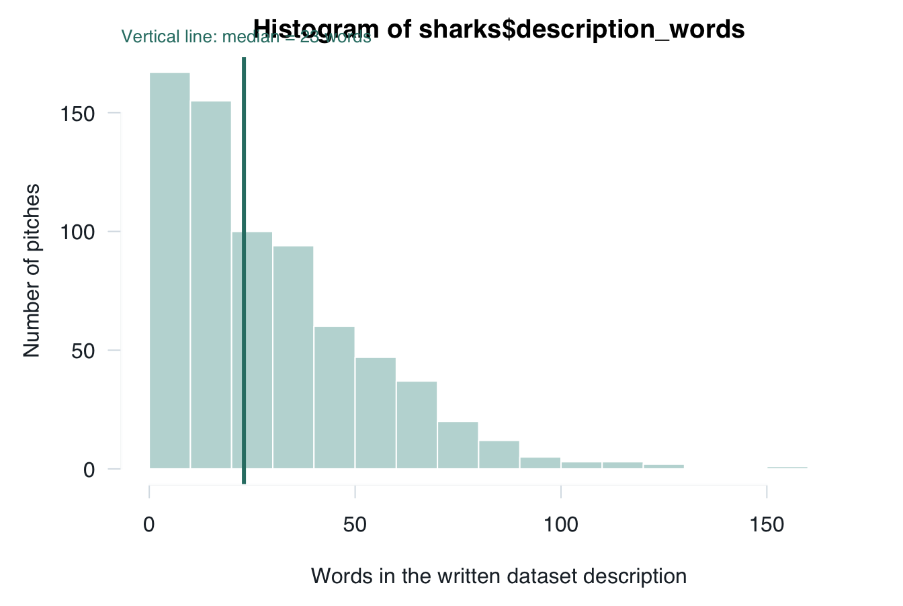
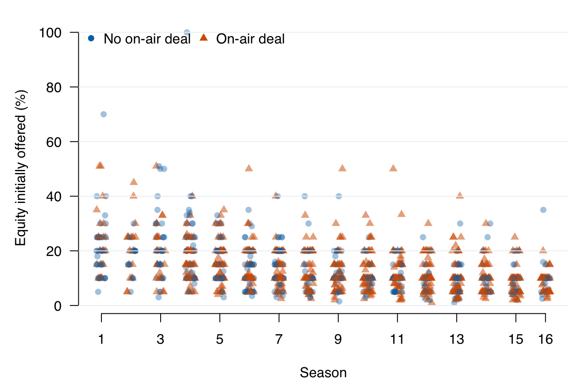
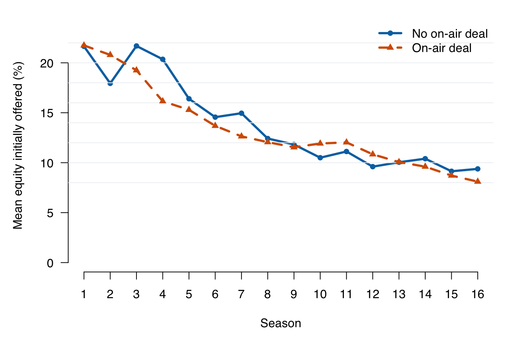

# (PART) Course 1 · Basic {-}

# Lecture 1: Introduction to Data Analysis {#b01}


<div class="outcomes">
<span class="label">By the end of Lecture 1, you can</span>
<ul>
<li>organise a reproducible R analysis and verify AI-assisted work;</li>
<li>distinguish categorical, discrete, continuous, and identifier variables;</li>
<li>identify a sample, a target population, sampling variability, and selection
bias;</li>
<li>inspect, validate, summarise, visualise, and qualify a real dataset.</li>
</ul>
</div>

::: {.course-phase .phase-before}

## Before class

Allow about 30 minutes for this preparation.

1. Read [How to use this book](#how-to-use-this-book) and locate the sections
   called **Before class**, **In class**, and **After class**.
2. Open RStudio through an R project. Create a new script and save it before
   writing code.
3. [Download `shark_tank_teaching.csv`](data/shark_tank_teaching.csv){download="shark_tank_teaching.csv"}
   and place it in a folder called `data` inside your project. Keep the
   downloaded file unchanged.
4. Run the following commands and bring the output to class.


``` r
sharks <- read.csv("data/shark_tank_teaching.csv",
                   stringsAsFactors = FALSE)

dim(sharks)
```

```
## [1] 706   5
```

``` r
names(sharks)
```

```
## [1] "pitch_id"          "deal_on_show"      "season"           
## [4] "episode"           "description_words"
```

``` r
head(sharks, 3)
```

```
##   pitch_id deal_on_show season episode description_words
## 1        1            1      8      26                58
## 2        2            0      8      26                31
## 3        3            0      8      26                71
```

Write one sentence answering: **What do you think one row in the dataset represents?** It is
fine if your answer changes during the lecture.

<details>
<summary>Check your answer</summary>

One row represents one recorded televised pitch from Seasons 1--8 of
*Shark Tank US*.

</details>

<div class="r-refresher">
<span class="label">R reactivation</span><br>
You used scripts, CSV files, data frames, summaries, and plots in
<a href="https://walshc.github.io/ebi-prog/">Programming for E&amp;BI</a>.
If the commands above feel unfamiliar, revisit its chapters on
<a href="https://walshc.github.io/ebi-prog/r-scripts.html">R scripts</a>,
<a href="https://walshc.github.io/ebi-prog/reading-csv-datasets.html">reading CSV files</a>, and
<a href="https://walshc.github.io/ebi-prog/dataframes-summary-statistics.html">summarising data frames</a>.
</div>

:::

::: {.course-phase .phase-in-class}

## In class

### 1. How the course works

Every lecture uses the same rhythm:

1. **Prepare before class.** Encounter the question, notation, data, or short
   explanation before the lecture.
2. **Participate during class.** Predict results, discuss choices, run code, and
   revise your reasoning with the teaching team.
3. **Practise after class.** Retrieve ideas from memory, reproduce the analysis,
   and explain results without copying a model answer.
4. **Use the exam preparation sessions.** Bring your attempts and questions;
   work in groups with classmates and teaching assistants.

Complete the **Before class** section before each lecture; use **After class**
to check that you can reproduce and explain the analysis independently.

### 2. Data analysis with R and AI

#### R reactivation

A reproducible script recreates the analysis in a new R session, without
depending on objects created earlier at the Console.

Use these habits from the start:

- open the project rather than changing the working directory with `setwd()`;
- keep downloaded data unchanged;
- use relative paths such as `data/shark_tank_teaching.csv`;
- record importing, checking, transforming, plotting, and modelling in scripts;
- give objects meaningful names;
- keep code and written interpretation together; and
- restart R and run the complete script before sharing the analysis.

#### The analysis cycle

Data analysis is iterative:

1. Ask a focused question.
2. Define the unit and decide how each idea will be measured.
3. Obtain or create the data and document their provenance.
4. Inspect and validate before calculating.
5. Summarise and visualise patterns.
6. Interpret the result in context and state its limits.

#### Use AI as a fallible assistant

AI systems generate plausible responses; they do not certify that a calculation,
source, or interpretation is correct. Use:

**Attempt -> Ask -> Verify -> Explain**

1. **Attempt** the question and identify where you are stuck.
2. **Ask** for a hint, diagnostic question, counterexample, or code review.
3. **Verify** every claim against the data, R output, course notation, and
   reliable sources.
4. **Explain** the result in your own words and ask for feedback on that
   explanation.

Do not share confidential, personal, or assessment-restricted material. You
remain responsible for every submitted claim.

### 3. In-class data collection exercise

The class will create its first dataset through an anonymous Mentimeter
activity.

#### A choice with money at risk

Imagine receiving EUR 100 and making one choice:

| Choice | Amount placed at risk | Possible final amounts |
|---|---:|---|
| Keep it | EUR 0 | EUR 100 for certain |
| Split it | EUR 50 | EUR 50 or EUR 150, each with 50% chance |
| Go all-in | EUR 100 | EUR 0 or EUR 200, each with 50% chance |

All three choices have the same average monetary payoff across many repetitions:
EUR 100. The options differ in how uncertain the one-time result is.

Next, answer:

> How do you see yourself in general? Use 0 for "not at all willing to take
> risks" and 10 for "very willing to take risks."

Finally, give your current belief:

> What is the probability that you will start or co-found a business at least
> once during the next ten years?

The class map places general risk willingness on the horizontal axis and the
subjective founder probability on the vertical axis. One anonymous point
represents one responding student.

#### From ideas to variables

| Variable | What is recorded | Type |
|---|---|---|
| `respondent_id` | anonymous row label | identifier |
| `amount_at_risk` | 0, 50, or 100 euros | discrete quantitative |
| `risk_willingness` | one selected point from 0 to 10 | ordered discrete rating |
| `founder_probability` | belief from 0% to 100% | continuous concept recorded on a finite-precision slider |

**Risk attitude** is a theoretical construct. The monetary choice and the
0-10 response are two imperfect measurements of it. They may disagree because
risk taking depends on context, hypothetical choices differ from real stakes,
and self-perceptions are imperfect. A single response is not a diagnosis of a
permanent personality type.

The first two responses offer separate allowable points. Founder probability
is conceptualised on the continuum from 0% to 100%, although the software
stores a rounded value.

#### Sample and target population

The **sample** consists of students who are present and respond. Plausible
target populations include:

- the responding students;
- everyone attending this lecture;
- all students enrolled in the Basic course;
- all first-year business students in the Netherlands; or
- all young adults in the Netherlands.

The data describe the respondents. They do not automatically represent wider
groups because attendance and participation are not random.

Two uncertainties must not be confused:

- **Sampling variability:** even a genuinely random sample can contain an
  unusual number of highly risk-tolerant students by chance. Larger random
  samples usually reduce this chance variation.
- **Selection bias:** a convenience sample can systematically exclude certain
  people. Collecting more responses from the same selected group does not
  necessarily repair that bias.

A probability sample of Dutch students would require a defined population, a
suitable sampling frame, and random selection. Non-response and measurement
error could still remain.

### 4. Analyse the Shark Tank data

#### Context and unit of observation

*Shark Tank US* is a television programme in which entrepreneurs present a
venture or product to a panel of investors known as sharks. Entrepreneurs may
ask for money in exchange for an ownership share. The investors question them,
negotiate, and may announce a deal during the episode.

The recorded outcome is an **on-air agreement**. It does not establish that an
investment was completed or that the venture later succeeded.

The teaching file contains 706 televised pitches from Seasons 1--8 and five
variables:

| Variable | Meaning | Type |
|---|---|---|
| `pitch_id` | row identifier | identifier |
| `deal_on_show` | 1 for an on-air agreement; 0 otherwise | binary categorical, stored as 0/1 |
| `season` | television season, 1-8 | ordered discrete/time index |
| `episode` | episode number within season | discrete identifier within season |
| `description_words` | words in the written dataset description | discrete quantitative count |

The table records selected features of each pitch. It does not measure the
spoken pitch, completed investment, or later venture performance.

#### Inspect and validate


``` r
dim(sharks)
```

```
## [1] 706   5
```

``` r
names(sharks)
```

```
## [1] "pitch_id"          "deal_on_show"      "season"           
## [4] "episode"           "description_words"
```

``` r
head(sharks, 4)
```

```
##   pitch_id deal_on_show season episode description_words
## 1        1            1      8      26                58
## 2        2            0      8      26                31
## 3        3            0      8      26                71
## 4        4            1      8      26                37
```

``` r
str(sharks)
```

```
## 'data.frame':	706 obs. of  5 variables:
##  $ pitch_id         : int  1 2 3 4 5 6 7 8 9 10 ...
##  $ deal_on_show     : int  1 0 0 1 1 1 1 1 0 1 ...
##  $ season           : int  8 8 8 8 8 8 8 8 8 8 ...
##  $ episode          : int  26 26 26 26 24 24 24 24 23 23 ...
##  $ description_words: int  58 31 71 37 43 34 40 35 14 52 ...
```

There are 706 rows and 5 columns. One row represents
one recorded televised pitch.


``` r
sum(is.na(sharks))
```

```
## [1] 0
```

``` r
sort(unique(sharks$deal_on_show))
```

```
## [1] 0 1
```

``` r
range(sharks$season)
```

```
## [1] 1 8
```

``` r
range(sharks$episode)
```

```
## [1]  1 29
```

``` r
range(sharks$description_words)
```

```
## [1]   2 159
```

The teaching variables contain no missing values. Deal status contains only 0
and 1; seasons run from 1 to 8; and written descriptions contain from
2 to 159 words.
These checks establish internal plausibility. They cannot establish that the
source captured every pitch or measured every concept well.

#### Summarise in context


``` r
deal_count <- sum(sharks$deal_on_show)
pitch_count <- nrow(sharks)
deal_rate <- mean(sharks$deal_on_show)

c(
  on_air_deals = deal_count,
  recorded_pitches = pitch_count,
  recorded_deal_rate = deal_rate
)
```

```
##       on_air_deals   recorded_pitches recorded_deal_rate 
##        383.0000000        706.0000000          0.5424929
```

Because a 0/1 variable has mean equal to its proportion of 1s,
`mean(deal_on_show)` is 54.2%. A defensible sentence is:

> In this dataset, 383 of 706 recorded pitches
> (54.2%) reached an on-air agreement.

This sentence names the dataset and outcome. It does not claim that a randomly
selected entrepreneur has the same chance of completed investment.

#### Visualise the distribution



Each bar counts descriptions within a word-count interval. The long right tail
means a small number of descriptions are much longer than most. Changing the
interval width can reveal or conceal patterns, so a histogram is an analytical
choice rather than decoration.

#### Compare raw observations and group means



Season is a discrete ordered time index, so the points are moved slightly left
or right only to reduce overlap. The vertical spread within every season warns
us that a group mean will not describe every pitch.



Mean written-description length is generally higher in Seasons 6--8 than in
Seasons 1--5 for both deal groups. This does not show that entrepreneurs learned
to make longer pitches: the variable describes dataset text, not the spoken
pitch.

A clear graph matches the variable types, labels its axes and groups, and makes
the claim inspectable. Colour is reinforced here by point shape and line type,
so the groups remain distinguishable without relying on colour alone.

:::

::: {.course-phase .phase-after}

## After class

### 1. Reproduce the workflow

Save the script. In RStudio, choose **Session > Restart R** to clear objects
from memory. Run the complete script from top to bottom. It should import the
data, perform the checks, calculate the deal rate, and recreate at least one
graph without relying on commands run earlier at the Console.

<details>
<summary>Check the result</summary>

A successful clean run reports 706 rows and five variables, a recorded on-air
deal rate of 383/706 (54.2%), the stated ranges, and recreates the graph without
an “object not found” error.

</details>

### 2. Retrieve the ideas

Answer without reopening the chapter, then check your answers.

1. What does one row represent, and which population can it describe directly?
2. Why is `pitch_id` an identifier rather than a quantitative measurement?
3. What is the difference between sampling variability and selection bias?
4. What exactly does `description_words` measure?
5. Why can the group-mean graph not establish that longer pitches cause deals?

<details>
<summary>Check your answers</summary>

1. One row is one recorded televised pitch; the file directly describes these
   706 records.
2. `pitch_id` labels a record. Arithmetic differences between its values have
   no substantive meaning.
3. Sampling variability is chance variation across random samples; selection
   bias is systematic distortion from how units enter the sample.
4. `description_words` counts words in the written dataset description.
5. The graph compares observational group means and does not isolate a causal
   effect. It also does not measure spoken pitch length.

</details>

### 3. Explain one graph

Write four sentences about either Shark Tank graph:

1. name the variables and units;
2. describe the main visible pattern;
3. state one defensible interpretation; and
4. state one important limitation or next question.

<details>
<summary>Check a model answer</summary>

Each point in the raw-data graph represents one recorded pitch, with season on
the horizontal axis and written-description word count on the vertical axis.
Word counts vary widely within every season and tend to be higher in later
seasons. This is evidence of an association between season and the recorded
description length. It does not show that spoken pitches became longer; the
dataset documentation process may have changed.

</details>

### 4. Practise variable and graph choices

Answer these questions without running R:

1. Why is `amount_at_risk` discrete rather than continuous?
2. Which graph would you use first for `description_words` alone?
3. Which graph would you use for risk willingness and founder probability?
4. Why should `pitch_id` not be averaged?

<details>
<summary>Check your answers</summary>

1. It can take only the offered values 0, 50, and 100 euros.
2. A histogram shows the distribution of one quantitative variable.
3. A scatterplot shows how two quantitative variables vary together.
4. `pitch_id` is a label. Its numerical magnitude and mean have no substantive
   interpretation.

</details>

### 5. Audit an AI answer

An AI assistant writes:

> "The dataset contains 706 successful companies and proves that longer
> pitches make investors fund startups."

Use **Attempt -> Ask -> Verify -> Explain** to correct it. Your final response
must use the observed count or percentage, name the measured outcome, and state
why the causal claim is unsupported.

<details>
<summary>Check a model correction after writing your own</summary>

The file contains 706 recorded televised pitches, of which 383 reached an
on-air agreement. It does not measure completed investment or later company
success. `description_words` counts words in a written dataset description,
not the spoken pitch, and the observational records do not establish that
changing description length would cause an investor decision.

</details>

Before Lecture 2, open its **Before class** section and complete the marked
preparation. Continue to
[Lecture 2: Probability foundations and random variables](#b02).

For a more formal explanation, consult
[Nieuwenhuis, *Statistical Methods for Business and Economics*](https://tilburguniversity.on.worldcat.org/oclc/317545871),
Chapters 1--5.

:::
