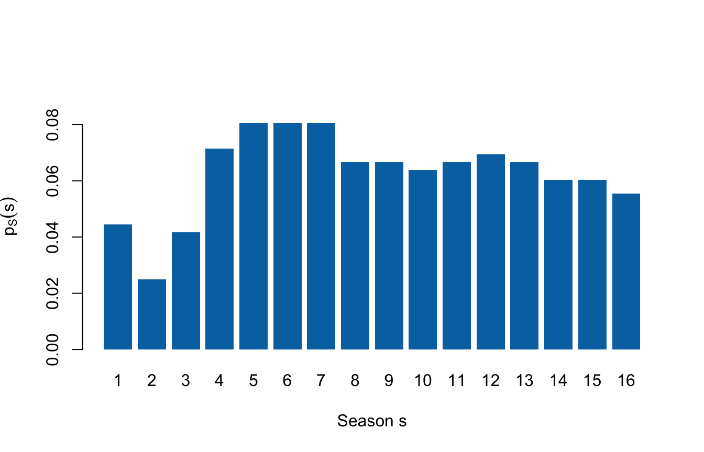
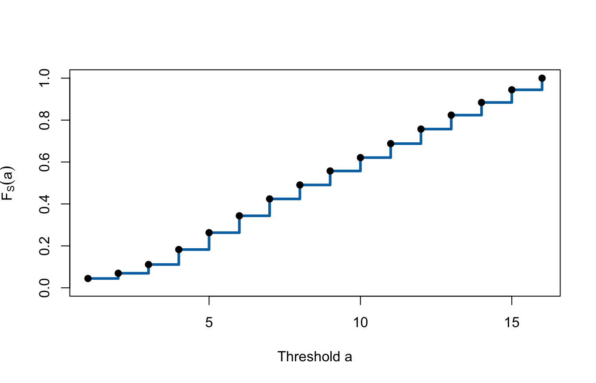

# Lecture 3: Discrete distributions and expectation {#b03}


<div class="outcomes">
<span class="label">By the end of Lecture 3, you can</span>
<ul>
<li>construct, check, and interpret a probability mass function;</li>
<li>construct and interpret a discrete cumulative distribution function;</li>
<li>calculate and interpret expectation and the expectation of a function;</li>
<li>connect model expectation to an empirical mean without confusing them.</li>
</ul>
</div>

::: {.course-phase .phase-before}

## Before class

<div class="video-prep">
<span class="label">Video preparation</span><br>
Watch
<a href="https://ocw.mit.edu/courses/res-6-012-introduction-to-probability-spring-2018/resources/probability-mass-functions/">Probability Mass Functions</a>,
<a href="https://www.youtube.com/watch?v=4QeL1ma_XJ0">Cumulative Distribution
Functions</a>, and
<a href="https://www.youtube.com/watch?v=_yJsO5955ZE">Expectation</a>.
Be ready to explain what \(p_X(x)\) and \(F_X(a)\) measure and why an expected
value need not be a possible realised value. All links are also listed in the
<a href="videos.html#videos">External Video Guide</a>.
</div>

If functions, support, or summation notation are unfamiliar, review
[Mathematics Refresher: functions and sums](#math-refresher).

Lecture 2 ended with random variables. Suppose one pitch record is selected
uniformly from the dataset. Define \(X=1\) if it reached an on-air deal and
\(X=0\) otherwise. Define \(S\) as its season number.

After watching, answer:

1. What are the possible values of \(X\) and \(S\)?
2. Do these possible values tell us how likely each value is?

<details>
<summary>Check your preparation</summary>

1. \(X\) can take the values 0 and 1. \(S\) can take the values
   \(1,2,\ldots,16\).
2. No. The support lists the possible values. A probability distribution must
   also assign probability to them.

</details>

:::

::: {.course-phase .phase-in-class}

## In class

### A PMF assigns probability to each possible value

<p class="concept-video"><strong>MIT explanation (review):</strong>
<a href="https://ocw.mit.edu/courses/res-6-012-introduction-to-probability-spring-2018/resources/probability-mass-functions/">05.3 Probability Mass Functions</a>.</p>

A random variable identifies the numerical values that may be observed. Its
distribution adds the missing information: how probability is divided among
those values.

For a discrete random variable \(X\), the **probability mass function (PMF)**
is

\[
p_X(x)=P(X=x).
\]

Read this notation in parts:

| Symbol | Meaning |
|---|---|
| \(X\) | the random variable |
| \(x\) | one possible numerical value |
| \(p_X\) | the PMF belonging to \(X\) |
| \(p_X(x)\) | the probability that \(X\) equals exactly \(x\) |

A valid PMF must satisfy

\[
p_X(x)\ge 0\quad\text{for every }x,
\qquad
\sum_{x\in\mathcal X}p_X(x)=1,
\]

where \(\mathcal X\) is the support of \(X\). The first rule prevents negative
probability. The second says that one of the possible values must occur.

For the deal indicator, \(X\in\{0,1\}\):

\[
p_X(0)=\frac{559}{1441},
\qquad
p_X(1)=\frac{882}{1441}.
\]


``` r
deal_pmf <- prop.table(
  table(factor(sharks$deal_on_show, levels = c(0, 1)))
)
names(deal_pmf) <- c("0: no on-air deal", "1: on-air deal")
deal_pmf
```

```
## 0: no on-air deal    1: on-air deal 
##         0.3879251         0.6120749
```

``` r
sum(deal_pmf)
```

```
## [1] 1
```

For season \(S\), the empirical PMF assigns each season its relative frequency
under the uniform record-selection experiment:


``` r
season_pmf
```

```
## 
##          1          2          3          4          5          6          7 
## 0.04441360 0.02498265 0.04163775 0.07147814 0.08049965 0.08049965 0.08049965 
##          8          9         10         11         12         13         14 
## 0.06662040 0.06662040 0.06384455 0.06662040 0.06939625 0.06662040 0.06037474 
##         15         16 
## 0.06037474 0.05551700
```

``` r
sum(season_pmf)
```

```
## [1] 1
```



The bar above season 5 has height
\(p_S(5)=P(S=5)=116/1441\approx0.080\). A PMF is represented by separated
probability masses because \(S\) can take only the listed discrete values.
The term **probability density function (PDF)** is reserved for continuous
random variables and is introduced later in the course.

### A CDF accumulates probability up to a threshold

<p class="concept-video"><strong>MIT explanation (review):</strong>
<a href="https://ocw.mit.edu/courses/res-6-012-introduction-to-probability-spring-2018/resources/cumulative-distribution-functions/">08.7 Cumulative Distribution Functions</a>.</p>

The PMF asks about one exact value. The **cumulative distribution function
(CDF)** asks how much probability has accumulated at or below a chosen
threshold. Imagine moving from left to right across the PMF and keeping a
running total.

For any random variable \(X\),

\[
F_X(a)=P(X\le a).
\]

Here \(a\) is a threshold, not necessarily a value in the support. For a
discrete random variable,

\[
F_X(a)=\sum_{x\le a}p_X(x).
\]

For season, each CDF value is the current PMF value plus all earlier PMF
values:


``` r
s_values <- as.numeric(names(season_pmf))
p_values <- as.numeric(season_pmf)
season_distribution <- data.frame(
  season = s_values,
  pmf = p_values,
  cdf = cumsum(p_values)
)
season_distribution
```

```
##    season        pmf        cdf
## 1       1 0.04441360 0.04441360
## 2       2 0.02498265 0.06939625
## 3       3 0.04163775 0.11103400
## 4       4 0.07147814 0.18251214
## 5       5 0.08049965 0.26301180
## 6       6 0.08049965 0.34351145
## 7       7 0.08049965 0.42401110
## 8       8 0.06662040 0.49063151
## 9       9 0.06662040 0.55725191
## 10     10 0.06384455 0.62109646
## 11     11 0.06662040 0.68771686
## 12     12 0.06939625 0.75711312
## 13     13 0.06662040 0.82373352
## 14     14 0.06037474 0.88410826
## 15     15 0.06037474 0.94448300
## 16     16 0.05551700 1.00000000
```

For example,

\[
F_S(3)=P(S\le3)
=p_S(1)+p_S(2)+p_S(3)
=\frac{160}{1441}\approx0.111.
\]



Every CDF is non-decreasing and right-continuous, with

\[
\lim_{a\to-\infty}F_X(a)=0
\qquad\text{and}\qquad
\lim_{a\to\infty}F_X(a)=1.
\]

For a discrete variable, the CDF is a step function. It stays flat between
possible values and jumps whenever probability mass is encountered.

The size of the jump at \(x\) recovers the PMF. If
\(F_X(x^-)\) denotes the CDF value immediately before \(x\), then

\[
p_X(x)=F_X(x)-F_X(x^-).
\]

For the deal indicator:

\[
F_X(a)=
\begin{cases}
0, & a<0,\\
1-p, & 0\le a<1,\\
1, & a\ge1,
\end{cases}
\]

where \(p=P(X=1)\). Thus \(p_X(1)=P(X=1)=p\), while
\(F_X(1)=P(X\le1)=1\). The PMF measures mass at exactly 1; the CDF includes
all mass through 1.

### Expectation is the distribution's weighted centre

<p class="concept-video"><strong>MIT explanation (review):</strong>
<a href="https://ocw.mit.edu/courses/res-6-012-introduction-to-probability-spring-2018/resources/expectation/">05.8 Expectation</a>.</p>

A distribution can contain many possible values and probabilities.
**Expectation** summarises its centre in one number. Values with larger
probabilities receive more weight:

\[
E[X]=\sum_{x\in\mathcal X}x\,p_X(x).
\]

This definition applies when the probability-weighted sum is well defined and
finite.

The notation \(E[X]\) is read “the expected value of \(X\).” The calculation
multiplies each possible value by its probability and adds the contributions.
It can also be viewed as the balance point of the probability distribution.

Expectation is a property of the specified distribution, not a prediction
that one observation will equal that number. It need not belong to the
support. The empirical expected season is about 8.8, for example, but there is
no Season 8.8.

For the deal indicator,

\[
E[X]=0(1-p)+1(p)=p.
\]

This identity explains why the mean of a 0/1 variable equals its proportion of
1s.


``` r
s <- season_distribution$season
p_s <- season_distribution$pmf

c(
  E_X = 0 * (1 - p_hat) + 1 * p_hat,
  E_S_from_pmf = sum(s * p_s),
  observed_mean_season = mean(sharks$season)
)
```

```
##                  E_X         E_S_from_pmf observed_mean_season 
##            0.6120749            8.7959750            8.7959750
```

Under independent repetitions of the same distribution, provided
\(E[|X|]<\infty\), the sample average tends to become close to \(E[X]\) as the
number of observations grows. This long-run interpretation does not make the
expected value a guarantee for a single observation.

### Expectation after transforming a variable

If \(g\) transforms each possible value of \(X\), the expected transformed
value is

\[
E[g(X)]=\sum_{x\in\mathcal X}g(x)p_X(x).
\]

The probabilities do not change: apply \(g\) to each possible value, weight
the transformed values by the original PMF, and add. For example,

\[
E[S^2]=\sum_s s^2p_S(s).
\]


``` r
c(
  E_S = sum(s * p_s),
  E_S_squared = sum(s^2 * p_s)
)
```

```
##         E_S E_S_squared 
##    8.795975   95.505205
```

Lecture 4 uses this rule to measure spread around \(E[X]\).

### Model expectation and the sample mean

For observed values \(x_1,\ldots,x_n\), the sample mean is

\[
\bar{x}=\frac{1}{n}\sum_{i=1}^n x_i.
\]

If the empirical distribution assigns probability \(1/n\) to every observed
row, its expectation is

\[
\sum_{i=1}^n x_i\frac{1}{n}=\bar{x}.
\]

The numerical answers agree, but the terms identify different objects.
Expectation describes a probability distribution; the sample mean summarises
observed data.


``` r
w <- sharks$description_words
c(
  mean_words = mean(w),
  empirical_expectation = sum(w * rep(1 / length(w), length(w)))
)
```

```
##            mean_words empirical_expectation 
##              4.995142              4.995142
```

Both calculations give about 5.0 words for these 1,441 records. Treating this
as the expected description length for future pitches requires additional
population and stability assumptions.

:::

::: {.course-phase .phase-after}

## After class

### Retrieval

1. What information does a PMF add to the support of a random variable?
2. What two requirements must every PMF satisfy?
3. What is the difference between \(p_X(x)\) and \(F_X(x)\)?
4. Why can an expectation be a value the random variable never takes?
5. What does \(E[g(X)]\) average?
6. When does an empirical expectation equal the sample mean?

<details>
<summary>Check your answers</summary>

1. The support lists possible values; the PMF assigns probability to each
   value.
2. Every probability mass is non-negative, and the masses sum to 1.
3. \(p_X(x)=P(X=x)\) is the mass at exactly \(x\);
   \(F_X(x)=P(X\le x)\) is all probability accumulated through \(x\).
4. Expectation is a probability-weighted average and need not belong to the
   support.
5. It averages the transformed values \(g(x)\), weighted by \(p_X(x)\).
6. They are equal when the empirical distribution assigns mass \(1/n\) to
   each of the \(n\) observed values.

</details>

### Practice

Let \(Y\) have support \(\{0,1,2\}\) and PMF
\(p_Y(0)=0.2\), \(p_Y(1)=0.5\), and \(p_Y(2)=0.3\).

1. Verify that this is a valid PMF.
2. Calculate \(F_Y(0.5)\) and \(F_Y(1)\).
3. Calculate \(E[Y]\) and \(E[Y^2]\).
4. For the deal indicator with \(p=882/1441\), calculate \(F_X(0.4)\).
5. Use the season CDF to calculate \(P(3<S\le6)\).

<details>
<summary>Check your answers</summary>

1. All masses are non-negative and \(0.2+0.5+0.3=1\).
2. \(F_Y(0.5)=P(Y=0)=0.2\), while
   \(F_Y(1)=P(Y\le1)=0.2+0.5=0.7\).
3. \(E[Y]=0(0.2)+1(0.5)+2(0.3)=1.1\), and
   \(E[Y^2]=0^2(0.2)+1^2(0.5)+2^2(0.3)=1.7\).
4. Because \(0\le0.4<1\),
   \(F_X(0.4)=P(X=0)=559/1441\approx0.388\).
5. \(P(3<S\le6)=F_S(6)-F_S(3)=335/1441\approx0.232\).

</details>

### Worked exam interpretation

**Question.** R reports `mean(deal_on_show) = 0.612`. Explain this
number as both a sample mean and an empirical expectation.

<details>
<summary>Check a model answer</summary>

Because the indicator equals 1 for an on-air agreement, its sample mean is the
observed deal proportion: 61.2% of the 1,441 records. If the empirical
distribution assigns mass \(1/1441\) to each record, its expectation is the same
weighted average, 0.612. This does not show later venture success or guarantee
the probability for a future pitch.

</details>

Practise now in [Tutorial 1](#b-ep01), then continue to
[Lecture 4: Variance, conditioning, and belief updating](#b04).

For a more formal explanation, consult
[Nieuwenhuis, *Statistical Methods for Business and Economics*](https://tilburguniversity.on.worldcat.org/oclc/317545871),
Chapter 8.

:::
