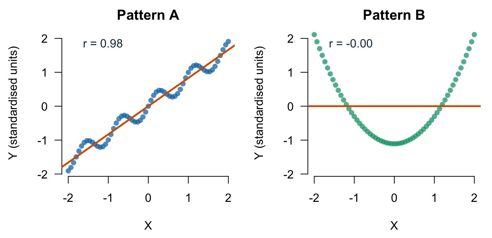
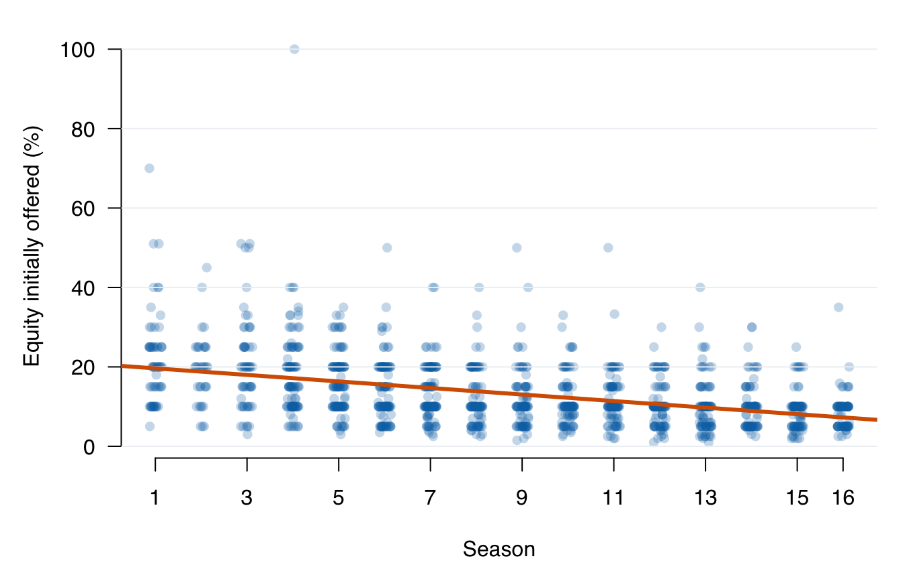

# Lecture 5: Joint random variables, covariance, and correlation {#b05}


<div class="outcomes">
<span class="label">By the end of Lecture 5, you can</span>
<ul>
<li>define a pair of random variables on one sample space;</li>
<li>read a joint PMF and recover marginal and conditional distributions;</li>
<li>derive covariance from expected cross-deviations;</li>
<li>explain how correlation standardises covariance;</li>
<li>separate linear association from independence, causality, and importance.</li>
</ul>
</div>

::: {.course-phase .phase-before}

## Before class

<div class="video-prep">
<span class="label">Video preparation</span><br>
Watch
<a href="https://www.youtube.com/watch?v=7nu97OYx4X4">Joint PMFs and the
Expected Value Rule</a>,
<a href="https://www.youtube.com/watch?v=K2Tlj27nkjs">Covariance</a>, and
<a href="https://www.youtube.com/watch?v=HTs6Zhc2S1M">The Correlation
Coefficient</a>. Be ready to state what a joint PMF records, what covariance
averages, and how correlation standardises covariance. All links are also
listed in the <a href="videos.html#videos">External Video Guide</a>.
</div>

If ordered pairs, products, or standardisation are unfamiliar, review
[Mathematics Refresher: products, indices, and z-scores](#math-refresher).

In the uniform record-selection experiment, one realised outcome \(\omega\) is
a complete pitch record. Define:

\[
X(\omega)=
\begin{cases}
1,&\text{on-air deal},\\
0,&\text{no on-air deal},
\end{cases}
\qquad
Y(\omega)=
\begin{cases}
1,&\text{Season 9--16},\\
0,&\text{Season 1--8}.
\end{cases}
\]

The pair \((X,Y)\) maps every outcome to one of four possible ordered pairs:

\[
\mathcal{X}\times\mathcal{Y}
=\{(0,0),(0,1),(1,0),(1,1)\}.
\]

Two separate marginal distributions do not tell us how values are paired. The
**joint distribution** does.

:::

::: {.course-phase .phase-in-class}

## In class

### The joint probability mass function

<p class="concept-video"><strong>MIT explanation (review):</strong>
<a href="https://ocw.mit.edu/courses/res-6-012-introduction-to-probability-spring-2018/resources/joint-pmfs-and-the-expected-value-rule/">06.7 Joint PMFs and the Expected Value Rule</a>.</p>

For discrete random variables \(X\) and \(Y\), the joint PMF is

\[
p_{X,Y}(x,y)=P(X=x,Y=y).
\]

It must be non-negative and sum to 1 over every possible pair.


``` r
joint_counts <- table(Deal = X, Late_period = Y)
joint_pmf <- prop.table(joint_counts)
joint_counts
```

```
##     Late_period
## Deal   0   1
##    0 330 229
##    1 377 505
```

``` r
round(joint_pmf, 3)
```

```
##     Late_period
## Deal     0     1
##    0 0.229 0.159
##    1 0.262 0.350
```

``` r
sum(joint_pmf)
```

```
## [1] 1
```

#### Recovering marginal PMFs

Sum over the values of the other variable:

\[
p_X(x)=\sum_y p_{X,Y}(x,y),
\qquad
p_Y(y)=\sum_x p_{X,Y}(x,y).
\]


``` r
rowSums(joint_pmf)
```

```
##         0         1 
## 0.3879251 0.6120749
```

``` r
colSums(joint_pmf)
```

```
##         0         1 
## 0.4906315 0.5093685
```

#### Recovering conditional PMFs

<p class="concept-video"><strong>MIT explanation (review):</strong>
<a href="https://ocw.mit.edu/courses/res-6-012-introduction-to-probability-spring-2018/resources/conditional-pmfs/">07.2 Conditional PMFs</a>.</p>

For \(p_Y(y)>0\),

\[
p_{X\mid Y}(x\mid y)=
\frac{p_{X,Y}(x,y)}{p_Y(y)}.
\]

The probability \(p_{X\mid Y}(1\mid1)\) is the late-season deal proportion
\(P(X=1\mid Y=1)=505/734\).


``` r
round(prop.table(joint_counts, margin = 2), 3)
```

```
##     Late_period
## Deal     0     1
##    0 0.467 0.312
##    1 0.533 0.688
```

The columns each sum to 1 because each column is a conditional PMF of \(X\)
within a fixed value of \(Y\).

### Independence in a joint distribution

<p class="concept-video"><strong>MIT explanations (review):</strong>
<a href="https://ocw.mit.edu/courses/res-6-012-introduction-to-probability-spring-2018/resources/independence-of-two-events/">03.3 Independence of Two Events</a> and
<a href="https://ocw.mit.edu/courses/res-6-012-introduction-to-probability-spring-2018/resources/independence-of-random-variables/">07.4 Independence of Random Variables</a>.</p>

Events \(A\) and \(B\) are independent when
\(P(A\cap B)=P(A)P(B)\). Equivalently, when \(P(B)>0\),
\(P(A\mid B)=P(A)\). Positive-probability disjoint events are not independent:
observing one makes the other impossible.

Discrete random variables \(X\) and \(Y\) are independent if

\[
p_{X,Y}(x,y)=p_X(x)p_Y(y)
\]

for every pair \((x,y)\). In a table, this equality must hold in every cell,
for every possible combination of values.


``` r
observed_joint_11 <- mean(X == 1 & Y == 1)
independent_joint_11 <- mean(X == 1) * mean(Y == 1)
c(observed_joint_11 = observed_joint_11,
  independent_joint_11 = independent_joint_11)
```

```
##    observed_joint_11 independent_joint_11 
##            0.3504511            0.3117717
```

Checking one combination of values is not enough to establish independence. A
mismatch in even one cell is enough to show dependence. Here, the mismatch in
the \((1,1)\) cell shows that the empirical variables are not independent.

### Covariance comes from expectation

<p class="concept-video"><strong>MIT explanation (review):</strong>
<a href="https://ocw.mit.edu/courses/res-6-012-introduction-to-probability-spring-2018/resources/covariance/">12.5 Covariance</a>.</p>

Lecture 4 defined variance as an expected squared deviation:

\[
\operatorname{Var}(X)=E[(X-E[X])^2].
\]

Covariance uses the same idea for two variables. Let
\(\mu_X=E[X]\) and \(\mu_Y=E[Y]\). Then

\[
\operatorname{Cov}(X,Y)
=E[(X-\mu_X)(Y-\mu_Y)].
\]

Interpret one product of deviations:

- if both values are above their means, the product is positive;
- if both are below their means, the product is also positive;
- if one is above and the other below, the product is negative.

The expectation averages those signed products over the joint distribution.
Expanding the product gives the computational identity:

\[
\operatorname{Cov}(X,Y)=E[XY]-E[X]E[Y].
\]


``` r
E_X <- mean(X)
E_Y <- mean(Y)
E_XY <- mean(X * Y)

c(
  E_X = E_X,
  E_Y = E_Y,
  E_XY = E_XY,
  covariance_from_moments = E_XY - E_X * E_Y
)
```

```
##                     E_X                     E_Y                    E_XY 
##              0.61207495              0.50936849              0.35045108 
## covariance_from_moments 
##              0.03867938
```

Covariance has product units. If \(X\) is measured in dollars and \(Y\) in
years, covariance is in dollar-years. Its sign is interpretable, but its
magnitude changes when either measurement unit changes.

#### Independence implies zero covariance

If \(X\) and \(Y\) are independent, then

\[
E[XY]=E[X]E[Y],
\]

so \(\operatorname{Cov}(X,Y)=0\). The reverse is not generally true: zero
covariance rules out linear co-movement, not every form of dependence.

### Correlation standardises covariance

<p class="concept-video"><strong>MIT explanations (review):</strong>
<a href="https://ocw.mit.edu/courses/res-6-012-introduction-to-probability-spring-2018/resources/the-correlation-coefficient/">12.8 The Correlation Coefficient</a> and
<a href="https://ocw.mit.edu/courses/res-6-012-introduction-to-probability-spring-2018/resources/interpreting-the-correlation-coefficient/">12.10 Interpreting the Correlation Coefficient</a>.</p>

For variables whose standard deviations are not zero,

\[
\rho_{XY}
=\frac{\operatorname{Cov}(X,Y)}
{\operatorname{SD}(X)\operatorname{SD}(Y)},
\qquad -1\le\rho_{XY}\le1.
\]

Correlation has no units. Its sign gives the direction of linear association,
and its magnitude measures the strength of linear association.


``` r
cov_xy <- mean((X - mean(X)) * (Y - mean(Y)))
rho_xy <- cov_xy / (sqrt(mean((X - mean(X))^2)) *
                    sqrt(mean((Y - mean(Y))^2)))
c(from_definition = rho_xy,
  from_R = cor(X, Y))
```

```
## from_definition          from_R 
##        0.158785        0.158785
```

A correlation near zero can coexist with a strong curved relationship.
A correlation near 1 or -1 does not establish causality.



Each point is one \((x,y)\) pair. The horizontal axis gives \(X\), and the
vertical axis gives \(Y\) in standardised units so the panels can be compared.
The orange line is the fitted linear summary. Pattern A follows an almost
straight rising path, so its correlation is close to 1. Pattern B has a clear
U-shaped relationship, but its fitted line is flat and its correlation is
close to 0. Correlation measures only **linear** association; it can miss a
strong relationship with another shape.

#### Sample covariance and sample correlation

For observed pairs \((x_i,y_i)\), the usual sample covariance is

\[
s_{XY}=\frac{1}{n-1}\sum_{i=1}^{n}
(x_i-\bar{x})(y_i-\bar{y}),
\]

and the sample correlation is

\[
r_{XY}=\frac{s_{XY}}{s_Xs_Y}.
\]

These are sample statistics. Under a model and sampling design, they may be
used to estimate population quantities \(\operatorname{Cov}(X,Y)\) and
\(\rho_{XY}\).

### Inspect first, summarise second

For two quantitative variables, begin with a scatterplot. Treating season as an
equally spaced time index:



Each point represents one pitch: season is read horizontally and initially
offered equity in percentage points vertically. Horizontal jitter only reveals
overlapping points; it does not change the recorded season. The orange line is
the fitted linear summary. Its downward direction describes negative linear
co-movement, while the large vertical spread shows why the line does not
predict every pitch closely.


``` r
c(
  season_with_equity_offered =
    cor(sharks$season, sharks$equity_offered_pct),
  equity_offered_with_deal =
    cor(sharks$equity_offered_pct, sharks$deal_on_show)
)
```

```
## season_with_equity_offered   equity_offered_with_deal 
##                 -0.4157650                 -0.1128703
```

Season and initially offered equity have a moderate negative linear association
(\(r\approx-0.42\)). Offered equity and the 0/1 deal indicator have a weak
negative association (\(r\approx-0.11\)). With a binary variable, ordinary
Pearson correlation is also called point-biserial correlation.

#### Why the association may mislead

Three patterns coexist:

1. later seasons have higher recorded deal proportions;
2. later seasons have lower initial equity offers;
3. deal records have slightly lower initial equity offers on average.

The marginal offered-equity/deal association may therefore partly reflect
differences between seasons. Offered equity was not randomly assigned, and the
file does not document a causal intervention.
Correlation alone does not establish causation, independence, or practical
importance.

:::

::: {.course-phase .phase-after}

## After class

### Retrieval

1. What information does a joint PMF contain that two marginal PMFs do not?
2. How do you recover a marginal PMF from a joint PMF?
3. Why can covariance change when units change?
4. Why does independence imply zero covariance?
5. Why does zero correlation not imply independence?

<details>
<summary>Check your answers</summary>

1. It records how values of the two variables occur together.
2. Sum the joint PMF over every value of the other variable.
3. Covariance has product units, so rescaling either variable rescales the
   covariance.
4. Independence gives \(E[XY]=E[X]E[Y]\), hence zero covariance for the
   variables considered in this course.
5. Correlation measures linear association; dependent variables can have zero
   linear association.

</details>

### Practice

Consider this joint PMF:

|  | \(Y=0\) | \(Y=1\) |
|---|---:|---:|
| \(X=0\) | 0.30 | 0.20 |
| \(X=1\) | 0.10 | 0.40 |

1. Find the marginal PMFs of \(X\) and \(Y\).
2. Are \(X\) and \(Y\) independent?
3. Calculate \(\operatorname{Cov}(X,Y)\) and interpret its sign.
4. Calculate \(P(X=1\mid Y=1)\) and compare it with \(P(X=1)\).
5. Define \(Z=100X\). Calculate \(\operatorname{Cov}(Z,Y)\) and state what
   happens to \(\operatorname{Corr}(Z,Y)\).

<details>
<summary>Check your answers</summary>

1. \(P(X=0)=0.50\), \(P(X=1)=0.50\), \(P(Y=0)=0.40\), and
   \(P(Y=1)=0.60\).
2. No. For example, \(P(X=1,Y=1)=0.40\), whereas
   \(P(X=1)P(Y=1)=0.50(0.60)=0.30\).
3. \(E[X]=0.50\), \(E[Y]=0.60\), and \(E[XY]=0.40\). Therefore,
   \(\operatorname{Cov}(X,Y)=0.40-0.50(0.60)=0.10\). The positive sign means
   the pair \((1,1)\) occurs with greater probability than the product of its
   marginal probabilities.
4. \(P(X=1\mid Y=1)=0.40/0.60=2/3\), which is larger than the marginal
   \(P(X=1)=0.50\). Conditioning on \(Y=1\) changes the distribution of \(X\).
5. \(\operatorname{Cov}(Z,Y)=100\operatorname{Cov}(X,Y)=10\).
   Multiplication by a positive constant changes covariance but leaves
   correlation unchanged.

</details>

### Worked exam interpretation

The dataset contains 1,441 televised pitches from Seasons 1--16. The variable
`season` records the season number, and `equity_offered_pct` records the
percentage of the business initially offered to the sharks.

**Question.** R reports
`cor(sharks$season, sharks$equity_offered_pct) = -0.416`. Interpret this
result in context. State:

1. the direction and approximate strength of the linear association;
2. what the association means for pitches in earlier and later seasons;
3. whether the correlation has units; and
4. one conclusion that cannot be justified from this result.

<details>
<summary>Check a model answer</summary>

Among the 1,441 records, season and initially offered equity have a moderate
negative linear association: later-season pitches tend to offer a smaller
ownership percentage initially, although this is not true of every individual
pitch. The correlation is dimensionless: it has no units. It summarises only
linear co-movement and does not show that the passage of time caused offers to
change.

</details>

Continue to [Tutorial 2: Conditioning and relationships](#b-ep02).

Formula sheet: [Lecture 5 formulas](#formula-l5).

For a more formal explanation, consult
[Nieuwenhuis, *Statistical Methods for Business and Economics*](https://tilburguniversity.on.worldcat.org/oclc/317545871),
Chapters 5 and 11.

:::
