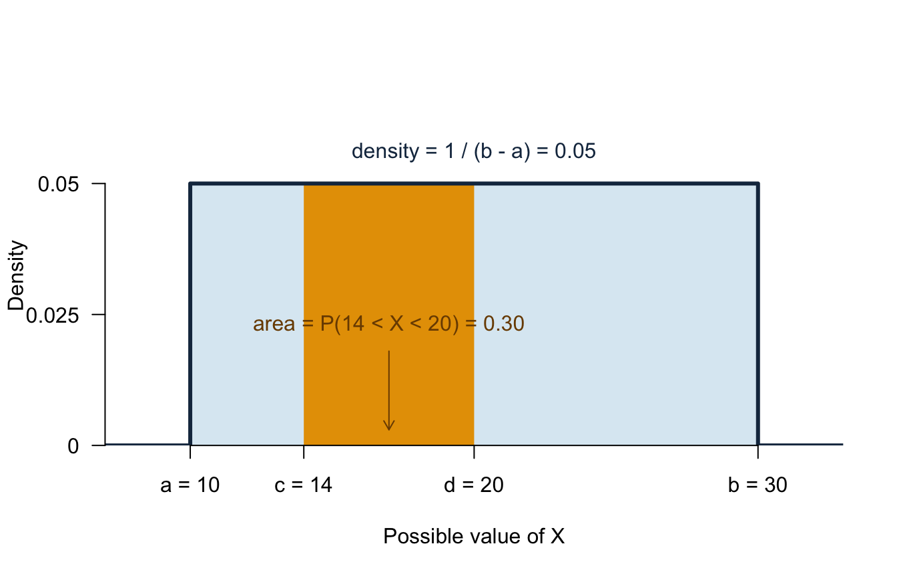
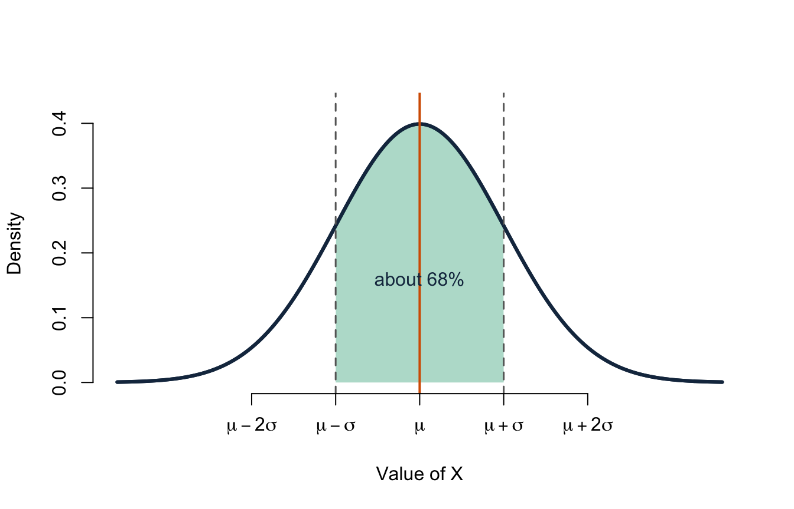
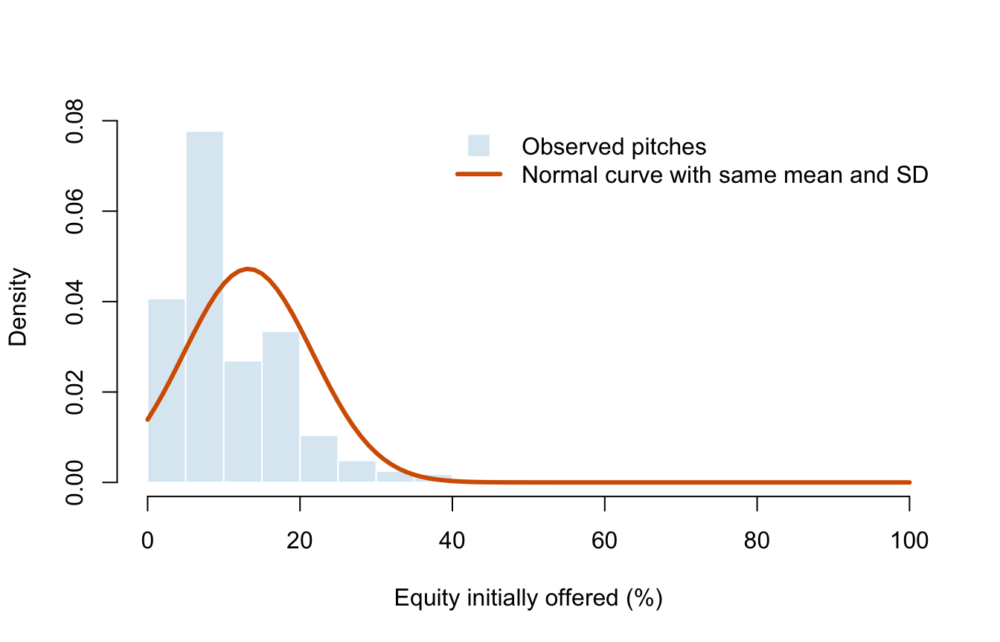

# Lecture 6: Continuous distributions and the normal model {#b06}


<div class="outcomes">
<span class="label">By the end of Lecture 6, you can</span>
<ul>
<li>distinguish a continuous random variable from a discrete one;</li>
<li>interpret a probability density function as area rather than point probability;</li>
<li>use a CDF to calculate interval probabilities;</li>
<li>recognise uniform and normal models;</li>
<li>standardise a normal random variable and calculate probabilities in R.</li>
</ul>
</div>

::: {.course-phase .phase-before}

## Before class

<div class="video-prep">
<span class="label">Video preparation</span><br>
Watch <a href="https://www.youtube.com/watch?v=8QFpZ3FndBc">Probability
Density Functions</a>, <a href="https://www.youtube.com/watch?v=JoQDJMZA7F8">Uniform
Random Variables</a>, and <a href="https://www.youtube.com/watch?v=6UMv4vb4y7c">Normal
Random Variables</a>. Focus on the difference between density height and
probability, and on the roles of the two normal parameters.
</div>

If powers, square roots, inequalities, or functions feel unfamiliar, review
[Mathematics Refresher: powers, functions, and intervals](#math-refresher).

A discrete random variable has separated possible values. A continuous random
variable can take every real value in an interval. Match each variable to the
better description:

1. number of sharks in an on-air deal;
2. exact time spent negotiating a pitch;
3. season number;
4. exact amount invested, before rounding to dollars.

<details>
<summary>Check your preparation</summary>

Variables 1 and 3 are discrete. Variables 2 and 4 are continuous in a
mathematical model, even if a measuring device or database records rounded
values.

</details>

:::

::: {.course-phase .phase-in-class}

## In class

<p class="concept-video"><strong>MIT explanations (review):</strong>
<a href="https://ocw.mit.edu/courses/res-6-012-introduction-to-probability-spring-2018/resources/probability-density-functions/">08.2 Probability Density Functions</a>,
<a href="https://ocw.mit.edu/courses/res-6-012-introduction-to-probability-spring-2018/resources/uniform-random-variables/">05.5 Uniform Random Variables</a>, and
<a href="https://ocw.mit.edu/courses/res-6-012-introduction-to-probability-spring-2018/resources/normal-random-variables/">08.8 Normal Random Variables</a>.</p>

### From probability mass to probability density

For a discrete random variable, a PMF assigns probability to individual
values. For a continuous random variable \(X\), every individual point has
probability zero:

\[
P(X=x)=0.
\]

Probabilities belong to **intervals**. A probability density function (PDF),
written \(f_X(x)\), is a non-negative curve whose total area is 1. The
probability that \(X\) lies between \(a\) and \(b\) is the area under the
curve between those values.

For completeness, that area is written

\[
P(a<X\le b)=\int_a^b f_X(x)\,dx.
\]

You will not be asked to evaluate integrals in this course. You do need to
interpret areas and use R or supplied tables to calculate them.

Density is not probability. A density can exceed 1 as long as the total area
under the curve is 1.

### The CDF works for every random variable

The cumulative distribution function is still

\[
F_X(x)=P(X\le x).
\]

For a continuous random variable,

\[
P(a<X\le b)=F_X(b)-F_X(a).
\]

Because a single point has zero probability, changing \(<\) to \(\le\) does
not change a continuous probability. This differs from a discrete variable,
where a point may carry positive probability.

### The uniform distribution

If every equal-length subinterval of \([a,b]\) is equally likely, then
\(X\sim U(a,b)\). Its density is constant:

\[
f_X(x)=\frac{1}{b-a},\qquad a\le x\le b.
\]

The **support** is the interval \([a,b]\). Outside it, the density is zero.
The constant height \(1/(b-a)\) is forced by the requirement that the whole
rectangle have area 1:

\[
\text{width}\times\text{height}
=(b-a)\frac{1}{b-a}=1.
\]

Because the height is constant, interval probability depends only on interval
length. An interval twice as long has twice the probability.

For \(a\le c<d\le b\),

\[
P(c<X<d)=\frac{d-c}{b-a}.
\]



Read the horizontal axis as possible values of \(X\) and the vertical axis as
density, not probability. The navy density line is at 0 before \(a=10\), jumps
to 0.05 on the support, and drops back to 0 after \(b=30\). The orange
probability is an **area**, not the height of the rectangle:
\(6\times0.05=0.30\). The numerical size of a density depends on the units.
Changing minutes to seconds changes the density height but not the probability
of the same time interval.

The mean and variance are

\[
E[X]=\frac{a+b}{2},
\qquad
\operatorname{Var}(X)=\frac{(b-a)^2}{12}.
\]

**Example.** If an anonymised pitch order is modelled as uniformly distributed
over a 90-minute session, the probability of appearing during a particular
18-minute interval is \(18/90=0.20\).

### The normal distribution

A normal random variable is written

\[
X\sim N(\mu,\sigma^2).
\]

The density is symmetric and bell-shaped. The parameter \(\mu\) locates its
centre; \(\sigma>0\) controls its spread. Consequently,

\[
E[X]=\mu,
\qquad
\operatorname{Var}(X)=\sigma^2.
\]



The horizontal axis locates possible values relative to \(\mu\) and
\(\sigma\); the vertical axis is density. Probability is again represented by
area. The shaded central area lies between \(\mu-\sigma\) and
\(\mu+\sigma\) and contains about 68% of a normal distribution. Approximately
95% lies within 1.96 standard deviations. These percentages describe the
mathematical normal model; they are not automatic facts about every dataset.

The normal distribution is a model, not a label for every quantitative
variable. Skewness, extreme outliers, bounds, or multiple peaks can make it a
poor description. The next graph checks the model against the observed
distribution of initial equity offers. The bars show the data; the orange
curve is the normal density with the same sample mean and standard deviation.



The horizontal axis records initial equity in percentage points. The vertical
axis is density, so bar **areas**, rather than heights alone, represent
proportions of pitches. The observed distribution is strongly right-skewed,
has repeated common percentage values, and is bounded between 0% and 100%.
The symmetric orange curve misses these important features, so a normal model
is not convincing for individual offers. Later, the normal model will often
describe a **sampling distribution** even when the original variable is not
normal.

### Standardising normal values

If \(X\sim N(\mu,\sigma^2)\), then

\[
Z=\frac{X-\mu}{\sigma}\sim N(0,1).
\]

A z-score reports how many standard deviations a value lies above or below
the mean. In R, `pnorm()` calculates cumulative probabilities and `qnorm()`
returns quantiles.


``` r
# P(X <= 70) when X ~ N(50, 10^2)
pnorm(70, mean = 50, sd = 10)
```

```
## [1] 0.9772499
```

``` r
# central 95% of the standard normal distribution
qnorm(c(0.025, 0.975))
```

```
## [1] -1.959964  1.959964
```

For \(X\sim N(50,10^2)\), the value 70 has z-score
\((70-50)/10=2\). About 97.7% of the distribution lies at or below it.

:::

::: {.course-phase .phase-after}

## After class

### Retrieval

1. Why is \(P(X=x)=0\) for a continuous random variable?
2. What quantity under a PDF represents probability?
3. How do you obtain \(P(a<X\le b)\) from a CDF?
4. What do \(\mu\) and \(\sigma\) control in a normal model?
5. What does a z-score of \(-1.5\) mean?

<details>
<summary>Check your answers</summary>

1. Probability is assigned to intervals; an individual point has zero width
   and therefore zero area.
2. Area under the density curve.
3. \(F_X(b)-F_X(a)\).
4. \(\mu\) controls the centre and \(\sigma\) the spread.
5. The value is 1.5 standard deviations below the mean.

</details>

### Practice

1. Let \(X\sim U(10,30)\). Find \(P(14<X<20)\), \(E[X]\), and
   \(\operatorname{SD}(X)\).
2. Let \(Y\sim N(100,15^2)\). Calculate \(P(Y\le115)\) and
   \(P(85<Y<115)\) in R.
3. Find the 90th percentile of \(N(100,15^2)\).
4. Explain why the normal curve in the graph is not a convincing model for
   offered equity.
5. A uniform variable is recorded in minutes and then converted to seconds.
   Explain what changes about the PDF and what remains unchanged.

<details>
<summary>Check your answers</summary>

1. \(P(14<X<20)=6/20=0.30\), \(E[X]=20\), and
   \(\operatorname{SD}(X)=20/\sqrt{12}\approx5.77\).
2. `pnorm(115, 100, 15)` gives about 0.841; subtracting
   `pnorm(85, 100, 15)` from it gives about 0.683.
3. `qnorm(0.90, 100, 15)` gives about 119.2.
4. The empirical distribution is bounded, right-skewed, and concentrated at
   a few common percentages; the fitted normal curve does not reproduce those
   features.
5. The numerical support and density height change with the units. Probabilities
   for corresponding time intervals remain unchanged because they are areas.

</details>

Continue to [Lecture 7: Samples, parameters, and estimators](#b07).

Formula sheet: [Lecture 6 formulas](#formula-l6).

For a more formal explanation, consult
[Nieuwenhuis, *Statistical Methods for Business and Economics*](https://tilburguniversity.on.worldcat.org/oclc/317545871),
Chapter 10.

:::
