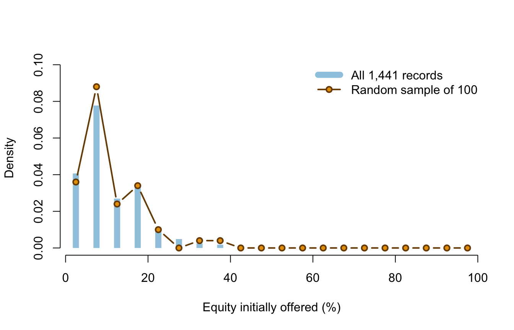

# Lecture 7: Samples, parameters, and estimators {#b07}


<div class="outcomes">
<span class="label">By the end of Lecture 7, you can</span>
<ul>
<li>distinguish a population, sampling frame, sample, and target population;</li>
<li>explain simple random sampling with and without replacement;</li>
<li>distinguish parameters, estimators, and estimates;</li>
<li>calculate sample means, proportions, variances, and standard deviations;</li>
<li>explain the \(n-1\) degrees of freedom in a sample variance;</li>
<li>explain why random sampling supports generalisation but does not guarantee it.</li>
</ul>
</div>

::: {.course-phase .phase-before}

## Before class

<div class="video-prep">
<span class="label">Video preparation</span><br>
Watch <a href="https://www.youtube.com/watch?v=nuXDb9B3y0M">The Sample
Mean and Some Terminology</a>. Be ready to distinguish a population quantity
from a statistic calculated after a sample is observed.
</div>

If subscripts or summation notation are not secure, review
[Mathematics Refresher: indices and sums](#math-refresher).

Suppose we want the mean initial equity offered across the 1,441 recorded
pitches in completed Seasons 1--16, but can inspect only 100 randomly selected
records. Identify:

1. the finite population;
2. the population variable;
3. the sample;
4. the parameter of interest;
5. a statistic that could estimate it.

<details>
<summary>Check your preparation</summary>

The finite population is the 1,441 recorded pitches; the variable is initial
equity offered; the sample is the 100 selected records; the parameter is the
population mean equity offer; and the sample mean is a suitable estimator.

</details>

:::

::: {.course-phase .phase-in-class}

## In class

<p class="concept-video"><strong>MIT explanation (review):</strong>
<a href="https://ocw.mit.edu/courses/res-6-012-introduction-to-probability-spring-2018/resources/the-sample-mean-and-some-terminology/">20.3 The Sample Mean and Some Terminology</a>.</p>

### Define the population before calculating

A **population** is the complete set of units about which a question is asked.
A **sample** is the subset observed for analysis. A **sampling frame** is the
list or mechanism from which the sample is selected. The **target population**
is the broader group to which we hope to generalise.

These sets need not coincide. The teaching file is a near-census of recorded
US *Shark Tank* pitches from completed Seasons 1--16, but it is not a random
sample of all entrepreneurs, all funding pitches, or even all applicants to
the show. Randomly sampling rows from this file supports inference to the
1,441-file population. It does not remove the show's selection process.

### Simple random sampling

In a simple random sample of size \(n\), every set of \(n\) population units
has the same chance of selection.

- **With replacement:** a selected unit is returned before the next draw.
  Draws are independent and each draw has the same distribution.
- **Without replacement:** a unit cannot be selected twice. Draws are
  dependent, although every draw has the same marginal distribution.

When a without-replacement sample is a small fraction of a large population,
the dependence is weak. This course uses the 10% condition as a practical
check: if \(n\le0.10N\), the usual independent-sample standard-error formulas
are a good approximation.


``` r
set.seed(123)
sample_rows <- sample(seq_len(nrow(sharks)), size = 100, replace = FALSE)
pitch_sample <- sharks[sample_rows, ]

nrow(pitch_sample)
```

```
## [1] 100
```

Here \(100/1441\approx0.069<0.10\).

### Sampling method determines the evidence boundary

The number of rows does not identify the sampling design. Ask how units entered
the data:

| Method | How units enter | Main implication |
|---|---|---|
| Simple random sample | selected by a known random mechanism | supports design-based generalisation to the frame |
| Stratified random sample | randomly selected within defined groups | can guarantee representation of important groups |
| Convenience sample | selected because they are easy to reach | vulnerable to selection bias |
| Voluntary-response sample | units choose whether to respond | people with stronger views may be over-represented |
| Census of a frame | every unit in the available frame is recorded | no sampling error for that frame, but coverage error can remain |

The Shark Tank teaching file is close to a census of its recorded-pitch frame.
When we draw 100 rows for an inference exercise, the randomisation is created
by our row-sampling procedure. It does not make the television programme's
selection of pitches random.

### Parameters, estimators, and estimates

A **parameter** is a fixed numerical property of a population, usually
unknown. An **estimator** is a rule based on random sample variables. Its value
changes from sample to sample. An **estimate** is the number obtained from one
realised sample.

For a random sample \(X_1,\ldots,X_n\):

\[
\bar X=\frac{1}{n}\sum_{i=1}^{n}X_i
\]

is an estimator of the population mean \(\mu\). After observing values
\(x_1,\ldots,x_n\),

\[
\bar x=\frac{1}{n}\sum_{i=1}^{n}x_i
\]

is the realised estimate. Capital letters describe random quantities before
sampling; lower-case letters describe observed values.

For a 0/1 variable, the sample proportion is a sample mean:

\[
\widehat P=\frac{1}{n}\sum_{i=1}^{n}X_i.
\]

Its realised value is written \(\hat p\).

The usual sample variance and standard deviation are

\[
S^2=\frac{1}{n-1}\sum_{i=1}^{n}(X_i-\bar X)^2,
\qquad S=\sqrt{S^2}.
\]

The denominator \(n-1\) makes \(S^2\) an unbiased estimator of population
variance under independent random sampling.

### Why the sample variance has \(n-1\) degrees of freedom

Once \(\bar X\) has been calculated from the same sample, the deviations must
satisfy

\[
\sum_{i=1}^{n}(X_i-\bar X)=0.
\]

If \(n-1\) deviations are known, the final deviation is forced to make the sum
zero. Only \(n-1\) deviations can vary freely: the sample variance has
\(n-1\) **degrees of freedom**.

For example, suppose three deviations from a sample mean begin with \(2\) and
\(-5\). The third cannot be chosen freely; it must be \(3\). There are three
deviations but only two degrees of freedom.

Using the fitted sample mean makes squared deviations around \(\bar X\)
slightly too small on average as a measure of population spread. Dividing by
\(n-1\), rather than \(n\), corrects that downward bias under the random-sample
model. Degrees of freedom count remaining independent information; they are
not a percentage or a probability.


``` r
c(
  sample_mean_equity = mean(pitch_sample$equity_offered_pct),
  sample_sd_equity = sd(pitch_sample$equity_offered_pct),
  sample_deal_proportion = mean(pitch_sample$deal_on_show)
)
```

```
##     sample_mean_equity       sample_sd_equity sample_deal_proportion 
##              12.760000               7.707887               0.640000
```

For this realised sample, \(\bar x=12.76\) percentage points,
\(s=7.71\) percentage points, and \(\hat p=0.64\).

### Sampling variability is visible



The sample resembles the population but does not reproduce it exactly. A
different random sample would give different estimates. This random
sample-to-sample variation is the uncertainty that sampling distributions
describe.

### What random sampling can and cannot do

Random selection reduces systematic over-representation within the sampling
frame. It does not guarantee that one realised sample is perfectly balanced.
By chance, a sample can contain unusually many large values or unusually many
deals. Larger samples reduce this random instability.

Random sampling supports generalisation from sample to frame. Random
assignment supports causal comparisons. They answer different design
questions and should not be confused.

:::

::: {.course-phase .phase-after}

## After class

### Retrieval

1. What is the difference between a target population and a sampling frame?
2. Why are draws without replacement dependent?
3. What is the difference between an estimator and an estimate?
4. Why is a sample proportion a sample mean?
5. Why does the sample variance have \(n-1\) degrees of freedom?
6. What does random sampling support that random assignment does not?

<details>
<summary>Check your answers</summary>

1. The target population is the group of substantive interest; the sampling
   frame is the set from which units can actually be selected.
2. Selecting one unit changes which units remain available.
3. An estimator is a random rule before data are observed; an estimate is its
   realised numerical value.
4. A 0/1 indicator sums to the number of successes, so its mean is the success
   proportion.
5. Estimating the sample mean imposes one constraint: all deviations from it
   must sum to zero. Only \(n-1\) deviations can vary freely.
6. Random sampling supports generalisation to the sampling frame; random
   assignment supports causal comparison of treatments.

</details>

### Practice

1. For a population of \(N=20{,}000\) customers and a simple random sample of
   \(n=500\), check the 10% condition.
2. Write the estimator and realised estimate for the population deal
   proportion.
3. Explain why \(\mu\) is fixed while \(\bar X\) is random.
4. Using `pitch_sample`, calculate the sample mean and sample SD of
   `description_words`.
5. Explain why this random sample cannot justify conclusions about all US
   entrepreneurs.
6. For a sample of five observations, state the degrees of freedom used to
   estimate variance and explain the number.

<details>
<summary>Check your answers</summary>

1. \(500/20{,}000=0.025<0.10\), so the condition is satisfied.
2. The estimator is
   \(\widehat P=n^{-1}\sum_iX_i\); the realised estimate is
   \(\hat p=n^{-1}\sum_ix_i\).
3. The population and its mean are treated as fixed; the selected observations,
   and therefore their mean, vary across possible samples.
4. `mean(pitch_sample$description_words)` and
   `sd(pitch_sample$description_words)` give the requested estimates.
5. The sample was selected from televised records, not from all US
   entrepreneurs; random row selection cannot repair that coverage gap.
6. The degrees of freedom are \(5-1=4\). Once the sample mean is estimated,
   four deviations may vary freely and the fifth is fixed by their zero sum.

</details>

Continue to [Lecture 8: Sampling distributions and the central limit theorem](#b08).

Formula sheet: [Lecture 7 formulas](#formula-l7).

For a more formal explanation, consult
[Nieuwenhuis, *Statistical Methods for Business and Economics*](https://tilburguniversity.on.worldcat.org/oclc/317545871),
Chapter 12.

:::
