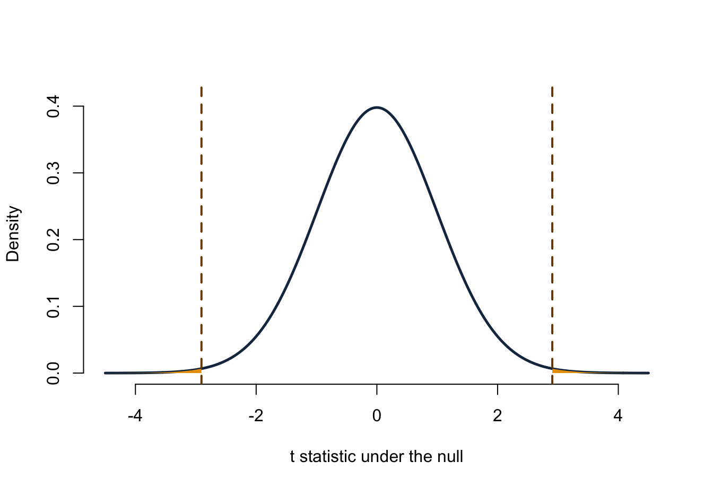

# Lecture 9: Confidence intervals and tests against zero {#b09}


<div class="outcomes">
<span class="label">By the end of Lecture 9, you can</span>
<ul>
<li>construct a t confidence interval for a population mean;</li>
<li>express comparison with a benchmark as a parameter equal to zero;</li>
<li>state a two-sided null and alternative hypothesis;</li>
<li>calculate and interpret a t statistic and two-sided p-value;</li>
<li>connect a 95% confidence interval to a 5% two-sided test.</li>
</ul>
</div>

::: {.course-phase .phase-before}

## Before class

<div class="video-prep">
<span class="label">Video preparation</span><br>
Watch <a href="https://www.youtube.com/watch?v=NInNhFm046w">Confidence
Intervals</a>,
<a href="https://www.youtube.com/watch?v=MzvRQFYUEFU">Confidence Intervals
When the Variance Is Unknown</a>, and
<a href="https://www.youtube.com/watch?v=ti9NFdjf3sM">Introduction to
Hypothesis Testing</a>. Focus on repeated-sampling coverage, the t reference
distribution, and the role of the null value.
</div>

Review [Mathematics Refresher: intervals, standardisation, and degrees of
freedom](#math-refresher) if needed.

Let \(X\) be initial equity offered and define the **equity gap**

\[
D=X-15.
\]

Write two-sided hypotheses for the question: “Does population mean initial
equity differ from 15 percentage points?”

<details>
<summary>Check your preparation</summary>

Let \(\delta=E[D]=\mu_X-15\). Then

\[
H_0:\delta=0
\qquad\text{versus}\qquad
H_1:\delta\ne0.
\]

This is equivalent to testing \(H_0:\mu_X=15\) against
\(H_1:\mu_X\ne15\). Writing the contrast as \(\delta\) makes the central
question “is the difference zero?”—the same structure later used for
regression coefficients.

</details>

:::

::: {.course-phase .phase-in-class}

## In class

<p class="concept-video"><strong>Video explanations (review):</strong>
<a href="https://ocw.mit.edu/courses/res-6-012-introduction-to-probability-spring-2018/resources/confidence-intervals/">20.5 Confidence Intervals</a>,
<a href="https://ocw.mit.edu/courses/res-6-012-introduction-to-probability-spring-2018/resources/confidence-intervals-for-the-mean-when-the-variance-is-unknown/">20.7 Confidence Intervals with Unknown Variance</a>, and
<a href="https://www.youtube.com/watch?v=ti9NFdjf3sM">Introduction to Hypothesis Testing</a>.</p>

### Confidence intervals combine estimate and uncertainty

The general form is

\[
\text{estimate}
\ \pm\
\text{critical value}\times\text{standard error}.
\]

The product is the **margin of error**. A confidence interval becomes:

- wider when the confidence level increases;
- wider when observations are more variable;
- narrower when the sample size increases, all else equal.

For an independent normal sample with unknown population SD,

\[
\bar X\pm t_{1-\alpha/2,n-1}\frac{S}{\sqrt n}
\]

is a \(100(1-\alpha)\%\) confidence interval for \(\mu\). For a large
independent sample, the interval is also an approximation when the population
is not normal.

The degrees of freedom are \(n-1\): one degree of freedom was used to estimate
the sample mean before estimating spread. Lower degrees of freedom produce a
larger critical value because the t distribution has heavier tails.

### Check conditions before calculating

The formula is justified by the sampling design and distributional conditions,
not by the presence of an R command.

- The 100 rows were selected randomly from the 1,441-record frame.
- Sampling without replacement creates weak dependence, but
  \(100/1441<0.10\), so the usual independent-sample SE is a reasonable
  approximation.
- The pitch-level equity variable is right-skewed, but \(n=100\) makes the
  t approximation for the sample mean much more credible than it would be for
  a very small sample. We should still check for data errors or observations
  that dominate the mean.

These conditions support inference to the recorded-pitch frame. They do not
make televised pitches representative of all entrepreneurs.

### Estimate a difference from a benchmark

In the reproducible sample,


``` r
c(
  sample_mean_equity = mean(pitch_sample$equity_offered_pct),
  sample_mean_gap = gap_bar,
  sample_sd_gap = gap_sd,
  standard_error_gap = gap_se,
  degrees_of_freedom = df
)
```

```
## sample_mean_equity    sample_mean_gap      sample_sd_gap standard_error_gap 
##         12.7600000         -2.2400000          7.7078866          0.7707887 
## degrees_of_freedom 
##         99.0000000
```

The estimated population mean gap is \(-2.24\) percentage points: the sample
mean equity offer is 2.24 percentage points below the 15-point benchmark.


``` r
critical_t <- qt(0.975, df = df)
gap_ci <- gap_bar + c(-1, 1) * critical_t * gap_se
mean_ci <- benchmark + gap_ci

c(gap_lower = gap_ci[1], gap_upper = gap_ci[2])
```

```
##  gap_lower  gap_upper 
## -3.7694119 -0.7105881
```

``` r
c(mean_lower = mean_ci[1], mean_upper = mean_ci[2])
```

```
## mean_lower mean_upper 
##   11.23059   14.28941
```

The 95% interval for the mean gap is approximately
\((-3.77,-0.71)\) percentage points. Adding 15 to both endpoints gives the
equivalent interval \((11.23,14.29)\) for mean initial equity.

### A hypothesis test starts with a null model

For a two-sided test,

\[
H_0:\delta=0
\qquad\text{versus}\qquad
H_1:\delta\ne0.
\]

The null says there is no population mean difference from the benchmark. The
alternative allows a difference in either direction. Choose the two-sided
alternative from the research question before inspecting the sample estimate.

Standardise the estimated gap using the SE:

\[
T=
\frac{\widehat\delta-0}
{\operatorname{SE}(\widehat\delta)}
=
\frac{\bar D}{S_D/\sqrt n}.
\]


``` r
t_value <- gap_bar / gap_se
p_value <- 2 * pt(-abs(t_value), df = df)

c(
  estimate = gap_bar,
  standard_error = gap_se,
  t_statistic = t_value,
  degrees_of_freedom = df,
  two_sided_p_value = p_value
)
```

```
##           estimate     standard_error        t_statistic degrees_of_freedom 
##       -2.240000000        0.770788656       -2.906114385       99.000000000 
##  two_sided_p_value 
##        0.004515396
```

The observed statistic is approximately \(-2.91\). Its sign records direction;
its absolute value records distance from zero in standard-error units.

### A two-sided p-value uses both tails

The **p-value** is the probability, assuming \(H_0\), of obtaining a test
statistic at least as far from zero as the observed statistic in either
direction:

\[
p=P\!\left(|T_{99}|\ge|t_{obs}|\mid H_0\right).
\]



The horizontal axis gives possible t statistics if the null is true, and the
vertical axis is density. The dashed lines mark statistics as far from zero as
the observed value. The two orange tail areas beyond them sum to about 0.0046.
This is not the probability that \(H_0\) is true and not the size of the mean
gap.

At \(\alpha=0.05\), reject \(H_0\) because \(p<0.05\). The random sample
provides evidence that mean initial equity in the recorded-pitch frame differs
from 15 percentage points. The negative estimate indicates that it is lower.

### The confidence interval and test tell the same story

For the same two-sided t procedure:

- reject \(H_0:\delta=0\) at level \(\alpha\) exactly when the
  \(100(1-\alpha)\%\) confidence interval excludes zero;
- do not reject when the interval includes zero.

Here the gap interval \((-3.77,-0.71)\) excludes zero, matching the test
decision. The interval adds information the p-value does not: it displays the
direction, plausible magnitude, and precision of the difference.

### Interpret 95% confidence correctly

The parameter is fixed; interval endpoints vary from sample to sample. If the
same valid procedure were repeated many times, about 95% of the resulting
intervals would contain the parameter.

Do not say that this realised interval has a 95% probability of containing the
fixed parameter. Also remember that a narrow interval does not repair
selection bias, dependence, measurement error, or a wrong model.

:::

::: {.course-phase .phase-after}

## After class

### Retrieval

1. What are the three pieces of a confidence interval?
2. Why does a one-sample t procedure use \(n-1\) degrees of freedom?
3. What do \(H_0:\delta=0\) and \(H_1:\delta\ne0\) say?
4. Why does a two-sided p-value use two tails?
5. What is the exact decision link between a 95% t interval and a 5%
   two-sided t-test?
6. Why should an estimate and interval accompany a p-value?

<details>
<summary>Check your answers</summary>

1. Estimate, critical value, and standard error.
2. Estimating the sample mean imposes one constraint before spread is
   estimated, leaving \(n-1\) freely varying deviations.
3. The null states that the population contrast is zero; the alternative
   allows a non-zero contrast in either direction.
4. Values equally far below and above zero are both evidence against a
   two-sided null.
5. The test rejects exactly when the interval excludes zero, provided both use
   the same model and SE.
6. The estimate and interval show direction, magnitude, and precision; a
   p-value alone does not.

</details>

### Practice

1. A sample has \(n=64\), \(\bar x=80\), and \(s=16\). Define
   \(\delta=\mu-75\). Construct a 95% interval for \(\delta\).
2. Test \(H_0:\delta=0\) against \(H_1:\delta\ne0\) at 5%. Report the
   statistic, degrees of freedom, approximate p-value, decision, and
   contextual conclusion.
3. A coefficient-like estimate is 0.42 percentage points per €100,000, with
   SE 0.18 and \(df=120\). Test a two-sided zero null and construct a 95%
   interval.
4. Rewrite this claim correctly: “There is a 95% chance that the population
   mean is in my interval.”
5. Explain why a statistically significant mean gap need not be practically
   important or causal.

<details>
<summary>Check your answers</summary>

1. The estimated gap is \(80-75=5\), its SE is \(16/\sqrt{64}=2\), and
   \(t_{0.975,63}\approx2.00\). The interval is approximately
   \(5\pm2.00(2)=(1,9)\).
2. \(t=5/2=2.50\), \(df=63\), and the two-sided p-value is about 0.015.
   Reject \(H_0\): the data provide evidence that the population mean differs
   from 75; the positive estimate places it above 75.
3. \(t=0.42/0.18\approx2.33\), with a two-sided p-value about 0.021.
   The 95% interval is approximately
   \(0.42\pm1.98(0.18)=(0.064,0.776)\) percentage points per €100,000.
4. “The interval was produced by a procedure that captures the fixed
   population mean in about 95% of repeated valid samples.”
5. Statistical significance concerns precision relative to zero. Practical
   importance depends on the magnitude and decision context, while causality
   requires an appropriate design and assumptions.

</details>

Continue to [Lecture 10: Hypothesis testing, errors, and power](#b10).

Formula sheet: [Lecture 9 formulas](#formula-l9).

For a more formal explanation, consult
[Nieuwenhuis, *Statistical Methods for Business and Economics*](https://tilburguniversity.on.worldcat.org/oclc/317545871),
Chapters 15 and 16.

:::
