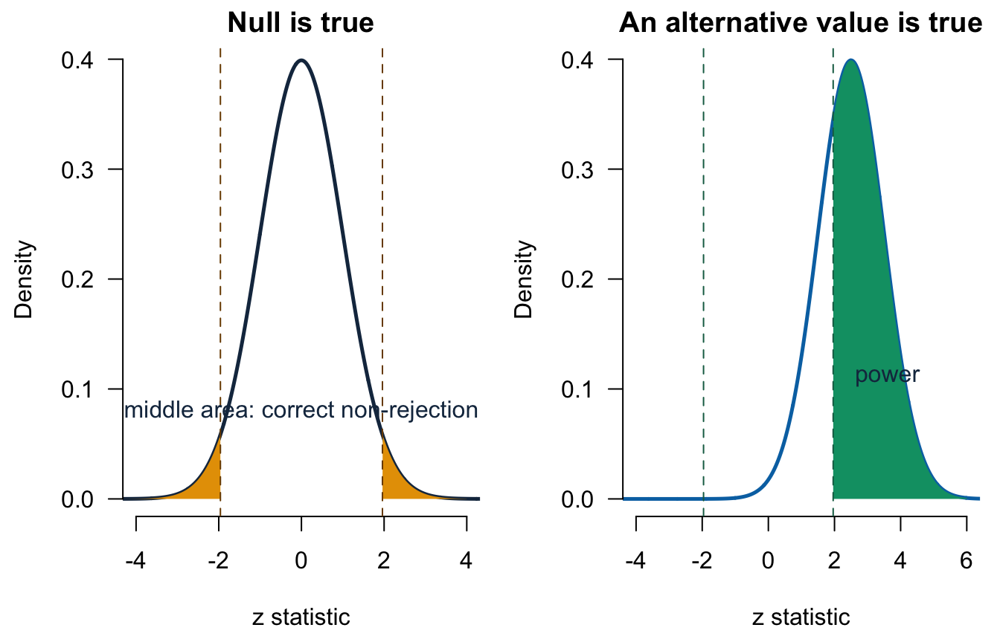

# Lecture 10: Hypothesis testing, errors, and power {#b10}


<div class="outcomes">
<span class="label">By the end of Lecture 10, you can</span>
<ul>
<li>complete and communicate a two-sided test against zero;</li>
<li>distinguish a p-value, significance level, and test decision;</li>
<li>describe Type I error, Type II error, and power in context;</li>
<li>separate statistical significance from magnitude, practical importance, and causality;</li>
<li>interpret the zero-null test printed for a regression coefficient.</li>
</ul>
</div>

::: {.course-phase .phase-before}

## Before class

<div class="video-prep">
<span class="label">Video preparation</span><br>
Review <a href="https://www.youtube.com/watch?v=ti9NFdjf3sM">Introduction to
Hypothesis Testing</a> and watch
<a href="https://www.youtube.com/watch?v=JNOWWJeZBTc">Examples Identifying
Type I and Type II Errors</a>. Focus on two-sided tests, decision errors, and
why “do not reject” is not “accept.”
</div>

Review [Mathematics Refresher: zero contrasts, inequalities, and
standardisation](#math-refresher) if needed.

Suppose R reports the following coefficient row:

| Estimate | SE | t | p-value |
|---:|---:|---:|---:|
| -0.290 | 0.058 | -5.00 | < 0.001 |

State the hypotheses and give a careful one-sentence statistical conclusion.

<details>
<summary>Check your preparation</summary>

The default two-sided coefficient test is
\(H_0:\beta=0\) against \(H_1:\beta\ne0\). Because the p-value is below
0.05, reject \(H_0\): the data provide evidence that the population-model
coefficient differs from zero. A full interpretation still needs the outcome,
predictor, units, held-fixed variables, population, and causal limit.

</details>

:::

::: {.course-phase .phase-in-class}

## In class

<p class="concept-video"><strong>Video explanations (review):</strong>
<a href="https://www.youtube.com/watch?v=ti9NFdjf3sM">Introduction to Hypothesis Testing</a> and
<a href="https://www.youtube.com/watch?v=JNOWWJeZBTc">Type I and Type II Errors</a>.</p>

### Why zero is the central benchmark

Many empirical questions ask whether a population contrast is absent:

- difference from a target: \(\delta=\mu-15\);
- difference in probabilities: \(\delta_p=p-0.50\);
- difference between two group means: \(\mu_1-\mu_0\);
- regression slope: \(\beta_j\).

In every case, “no difference” or “no linear association” becomes

\[
H_0:\theta=0
\qquad\text{versus}\qquad
H_1:\theta\ne0.
\]

Testing a non-zero benchmark can therefore be rewritten as a test of a
zero-valued contrast. This common structure is the bridge from Basic inference
to regression inference.

### A complete two-sided testing workflow

Use the same sequence every time:

1. Define the population parameter and its units.
2. State \(H_0\) and the two-sided \(H_1\) before inspecting the result.
3. Check the sampling and model conditions.
4. Calculate the estimate and its SE under the null model.
5. Standardise: \((\text{estimate}-0)/\text{SE}\).
6. Calculate the two-sided p-value and compare it with the pre-specified
   significance level \(\alpha\).
7. Report the estimate, uncertainty, decision, contextual meaning, and limits.

The significance level is a long-run decision threshold, commonly 0.05. The
p-value is calculated from the observed data under \(H_0\). They are not the
same object.

### Example: a deal-proportion contrast

Define

\[
\delta_p=p-0.50.
\]

The question is whether the finite-frame deal proportion differs from 50%:

\[
H_0:\delta_p=0
\qquad\text{versus}\qquad
H_1:\delta_p\ne0.
\]

Under the null, \(p_0=0.50\), so

\[
Z=
\frac{\widehat\delta_p-0}
{\sqrt{p_0(1-p_0)/n}}
=
\frac{\hat p-0.50}
{\sqrt{0.50(0.50)/n}}.
\]


``` r
null_se <- sqrt(p0 * (1 - p0) / n)
z_value <- deal_gap / null_se
two_sided_p <- 2 * pnorm(-abs(z_value))

c(
  sample_proportion = phat,
  estimated_gap = deal_gap,
  null_standard_error = null_se,
  z_statistic = z_value,
  two_sided_p_value = two_sided_p
)
```

```
##   sample_proportion       estimated_gap null_standard_error         z_statistic 
##         0.640000000         0.140000000         0.050000000         2.800000000 
##   two_sided_p_value 
##         0.005110261
```

The estimate is \(\widehat\delta_p=0.14\), or 14 percentage points. The
test statistic is \(z=2.80\) and the two-sided p-value is about 0.0051.
Reject the zero-gap null at 5%: the random sample provides evidence that the
recorded-pitch-frame deal proportion differs from 50%. Its positive estimate
places it above 50%.

The success-failure condition is checked under the null for this test:
\(np_0=50\) and \(n(1-p_0)=50\), both at least 10.

### Interval and test: report both

A large-sample 95% interval for the proportion uses the estimated SE:

\[
\hat p\pm1.96
\sqrt{\frac{\hat p(1-\hat p)}{n}}.
\]


``` r
estimated_se <- sqrt(phat * (1 - phat) / n)
proportion_ci <- phat + c(-1, 1) * 1.96 * estimated_se
gap_ci <- proportion_ci - p0

c(proportion_lower = proportion_ci[1],
  proportion_upper = proportion_ci[2])
```

```
## proportion_lower proportion_upper 
##          0.54592          0.73408
```

``` r
c(gap_lower = gap_ci[1], gap_upper = gap_ci[2])
```

```
## gap_lower gap_upper 
##   0.04592   0.23408
```

The proportion interval is approximately \((0.546,0.734)\); the equivalent
gap interval is \((0.046,0.234)\), which excludes zero. It agrees with the
test decision here.

The manual interval estimates its SE with \(\hat p\), while the test uses
\(p_0\). Because these are not exactly the same procedure, confidence-interval
and test decisions need not match perfectly near a boundary. Exact equivalence
requires a confidence interval obtained by inverting the same test.

### What a p-value does and does not mean

The two-sided p-value is

\[
P\!\left(|\text{test statistic}|
\ge|\text{observed statistic}|\mid H_0\right).
\]

It is not:

- \(P(H_0\mid\text{data})\);
- the probability that the result occurred “by chance”;
- the size or importance of the estimated contrast;
- evidence that the relationship is causal.

If \(p\le\alpha\), reject \(H_0\). If \(p>\alpha\), **do not reject**
\(H_0\). Do not say “accept \(H_0\)”: an imprecise study may simply lack
power to detect a meaningful non-zero parameter.

### Type I error, Type II error, and power

| Reality | Reject \(H_0\) | Do not reject \(H_0\) |
|---|---|---|
| \(H_0\) true | Type I error | Correct decision |
| \(H_1\) true | Correct decision | Type II error |

The significance level controls

\[
P(\text{reject }H_0\mid H_0\text{ true})=\alpha.
\]

Power is

\[
P(\text{reject }H_0\mid H_1\text{ true}).
\]



In the left panel, the orange rejection regions have total probability
\(\alpha=0.05\) when the null is true. In the right panel, green area is the
probability of correctly rejecting when the displayed alternative is true.

Power increases with:

- a larger true distance from zero;
- a larger sample;
- lower unexplained variation;
- a larger \(\alpha\), although that also raises Type I error.

### Statistical significance is not substantive importance

A tiny effect can be statistically significant in a large sample. A meaningful
effect can be non-significant in a small or noisy sample. Always report:

- the estimate in substantive units;
- a confidence interval;
- the p-value or decision;
- whether the magnitude matters for the business question;
- the sampling, measurement, and causal limits.

### Preview: the test attached to a regression slope

R applies the same zero-null logic to every regression coefficient. Consider
the simple model of initial equity offered on season:


``` r
preview_model <- lm(equity_offered_pct ~ season, data = sharks)
summary(preview_model)$coefficients
```

```
##               Estimate Std. Error   t value      Pr(>|t|)
## (Intercept) 20.4565874 0.46442667  44.04697 4.922706e-269
## season      -0.8241241 0.04752298 -17.34159  2.514546e-61
```

``` r
confint(preview_model)
```

```
##                  2.5 %     97.5 %
## (Intercept) 19.5455616 21.3676132
## season      -0.9173458 -0.7309023
```

The season slope is approximately \(-0.824\) percentage points per season.
Its t statistic divides that estimate by its SE. The printed two-sided test is

\[
H_0:\beta_1=0
\qquad\text{versus}\qquad
H_1:\beta_1\ne0.
\]

The interval excludes zero and the p-value is below 0.001, so the data provide
evidence of a non-zero population-model slope. This is an observational time
association, not a causal effect of moving a pitch to a later season.

Intermediate begins from this familiar estimate–SE–t–p-value structure and
adds careful coefficient interpretation, multiple predictors, and model
diagnostics.

:::

::: {.course-phase .phase-after}

## After class

### Retrieval

1. Why can most comparison hypotheses be written as a parameter equal to zero?
2. What is the difference between \(\alpha\) and a p-value?
3. What is a Type I error?
4. What is a Type II error?
5. Name three factors that increase power.
6. Why is “do not reject” different from “accept”?
7. What does \(H_0:\beta_j=0\) mean in a regression model?

<details>
<summary>Check your answers</summary>

1. Subtracting the benchmark or reference value creates a contrast; no
   difference corresponds to a zero contrast.
2. \(\alpha\) is a pre-specified long-run decision threshold; the p-value is
   calculated from the observed statistic under the null.
3. Rejecting \(H_0\) when it is true.
4. Not rejecting \(H_0\) when a specified alternative is true.
5. Any three of larger sample size, larger true effect, lower noise, or larger
   \(\alpha\).
6. A non-significant result may be too imprecise to distinguish a meaningful
   parameter from zero.
7. Holding the other included predictors fixed, the population-model
   coefficient for predictor \(j\) is zero.

</details>

### Practice

1. A sample of \(n=49\) difference scores has \(\bar d=3\) and \(s_d=14\).
   Test \(H_0:\delta=0\) against \(H_1:\delta\ne0\) at 5%.
2. In 200 trials there are 120 successes. Define
   \(\delta_p=p-0.50\) and perform a two-sided test against zero.
3. A multiple-regression coefficient is \(-0.290\) percentage points per
   €100,000, with SE 0.058 and \(df=1437\). Calculate its t statistic,
   approximate 95% interval, and interpretation.
4. Describe Type I and Type II errors for Question 2.
5. A coefficient estimate is economically negligible but has \(p<0.001\).
   Explain how both facts can be true.
6. State two reasons the regression preview cannot support a causal conclusion.

<details>
<summary>Check your answers</summary>

1. The SE is \(14/\sqrt{49}=2\), so \(t=3/2=1.50\), with \(df=48\).
   The two-sided p-value is about 0.140. Do not reject the zero mean-difference
   null at 5%.
2. \(\hat p=0.60\), \(\widehat\delta_p=0.10\), and the null SE is
   \(\sqrt{0.50(0.50)/200}\approx0.0354\). Thus \(z\approx2.83\) and the
   two-sided p-value is about 0.0047. Reject the zero-gap null.
3. \(t=-0.290/0.058=-5.00\). With a large \(df\), the 95% interval is
   approximately \(-0.290\pm1.96(0.058)=(-0.404,-0.176)\) percentage points
   per €100,000. Holding the other included predictors fixed, an additional
   €100,000 is associated with between about 0.176 and 0.404 percentage points
   less fitted outcome.
4. Type I: conclude that the population success proportion differs from 0.50
   when it equals 0.50. Type II: fail to detect a genuine specified difference
   from 0.50.
5. A large sample or low SE can estimate a very small coefficient precisely.
   Statistical precision does not determine practical importance.
6. The predictor was not randomly assigned, and omitted factors, selection,
   reverse direction, or measurement error can remain.

</details>

Continue to [Tutorial 4: Inference and tests against zero](#b-ep04).

Formula sheet: [Lecture 10 formulas](#formula-l10).

For a more formal explanation, consult
[Nieuwenhuis, *Statistical Methods for Business and Economics*](https://tilburguniversity.on.worldcat.org/oclc/317545871),
Chapters 15 and 16.

:::
