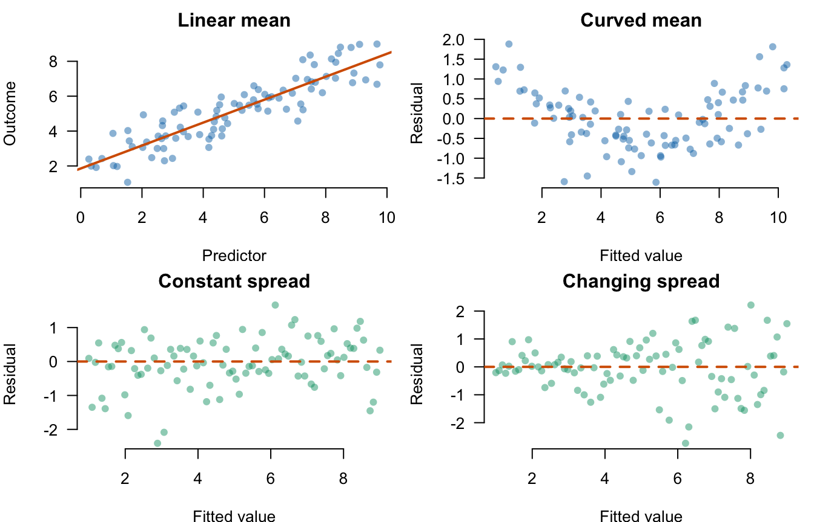
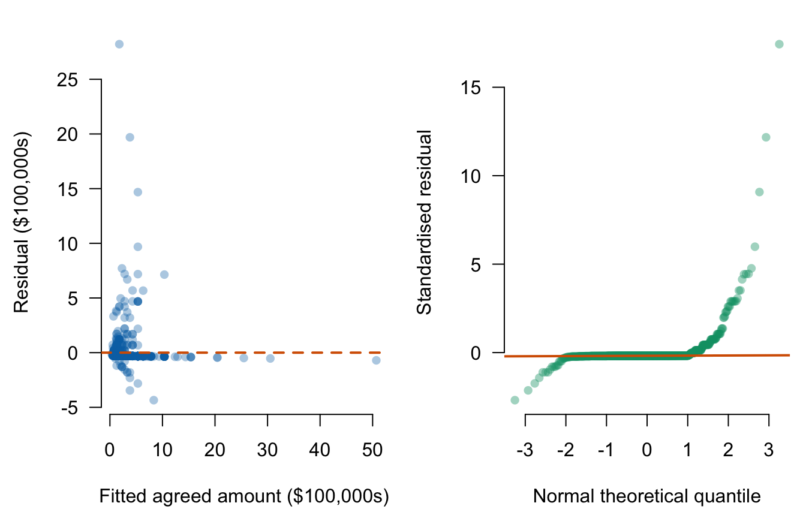

# Lecture 2: Regression assumptions and coefficient inference {#i02}


<div class="outcomes">
<span class="label">By the end of Lecture 2, you can</span>
<ul>
<li>state the assumptions behind ordinary least-squares estimation and inference;</li>
<li>inspect residual plots for non-linearity, unequal variance, and unusual observations;</li>
<li>interpret coefficient standard errors and confidence intervals;</li>
<li>test a regression coefficient against zero;</li>
<li>explain when robust standard errors help and what they cannot repair.</li>
</ul>
</div>

::: {.course-phase .phase-before}

## Before class

<div class="video-prep">
<span class="label">Video preparation</span><br>
Watch Stanford Statistical Learning
<a href="https://www.youtube.com/watch?v=3GiWpRfkSjc&list=PLoROMvodv4rOzrYsAxzQyHb8n_RWNuS1e&index=10">3.2
Hypothesis Testing and Confidence Intervals</a>. Focus on the standard error of
a coefficient and the test \(H_0:\beta_1=0\).
</div>

Review [Mathematics Refresher: standardisation and inequalities](#math-refresher)
if needed.

Explain in one sentence why a steep fitted slope can still be estimated
imprecisely.

<details>
<summary>Check your preparation</summary>

Slope size and slope precision are different: a steep estimate can have a
large standard error when the data are noisy, sparse, dependent, or dominated
by unusual observations.

</details>

:::

::: {.course-phase .phase-in-class}

## In class

<p class="concept-video"><strong>Stanford explanation (review):</strong>
<a href="https://www.youtube.com/watch?v=3GiWpRfkSjc">3.2 Hypothesis Testing and Confidence Intervals</a>.</p>

### What each assumption supports

For

\[
Y_i=\beta_0+\beta_1X_i+\varepsilon_i,
\]

separate the conditions below rather than memorising one vague statement that
“the data are normal.” Each condition supports a different part of the
analysis.

| Condition | Meaning | What it supports |
|---|---|---|
| Linear conditional mean | \(E[Y\mid X=x]=\beta_0+\beta_1x\) over the modelled range | One constant slope summarises the mean relationship |
| Zero conditional mean | \(E[\varepsilon\mid X]=0\) | The slope is not systematically absorbing omitted components related to \(X\) |
| Independent observations | Errors from different rows do not supply duplicate information | The usual standard-error calculation and effective sample size |
| Positive variation in \(X\) | Not all observations have the same predictor value | A slope can be estimated |
| Constant conditional variance | \(\operatorname{Var}(\varepsilon\mid X)=\sigma^2\) | Classical OLS standard errors have the stated form |
| Conditional normality | \(\varepsilon\mid X\) follows a normal distribution | Exact t and F reference distributions in small samples |

The outcome and predictor themselves do not need to be normally distributed.
The assumptions concern the conditional mean, errors, and sampling process.

#### Linearity is about the average, not every point

Individual outcomes need not lie on a line. Linearity says that the average
outcome at each predictor value follows a line. A systematic curve in
residuals means one constant slope misses part of that average pattern.

#### Constant variance is about vertical spread

Homoskedasticity says that the conditional variance is the same at each
predictor value. It does not say all residuals have the same size. A fan-shaped
residual plot—in which the vertical band widens or narrows—suggests changing
conditional variance.



The top-right pattern points to a misspecified conditional mean. The bottom
right pattern points to non-constant conditional variance. A real plot can
show both problems at once, and absence of a visible pattern is not proof that
all assumptions hold.

#### Zero conditional mean and independence require design knowledge

Residual plots cannot establish \(E[\varepsilon\mid X]=0\): fitted OLS
residuals are mechanically centred and unobserved confounders are not shown.
Ask how the observations were selected, what plausible common causes were
omitted, and whether measurement error or reverse direction is credible.

Independence also comes from the data-generating process. Repeated pitches by
one venture, teams within one network, or observations close in time may be
related. If rows share information, treating all of them as independent can
make the effective sample size look too large and SEs too small.

#### Conditional normality matters most in small samples

Normality concerns the distribution of errors at fixed predictor values. It is
used to derive exact small-sample t and F results. With large independent
samples and no dominant observations, approximate inference is often less
sensitive to moderate non-normality. Severe outliers can still distort both
the fitted line and its uncertainty.

### Diagnose with residuals



In the left panel, fitted outcomes are horizontal and observed-minus-fitted
residuals are vertical, in the outcome's original units. In the right panel,
the horizontal axis gives theoretical normal quantiles and the vertical axis
gives ordered standardised residuals; normal residuals should lie roughly on
the reference line. Use the panels to ask:

- Is there curvature around zero?
- Does vertical spread change with the fitted value?
- Are there unusually large residuals?
- Does the normal Q--Q plot depart strongly from a straight line?

These data contain influential high-value pitches and unequal residual spread.
The classical model summary is therefore a starting point, not the end of the
diagnosis.

### Standard errors and confidence intervals


``` r
summary(deal_model)
```

```
## 
## Call:
## lm(formula = deal_100k ~ ask_100k, data = deals)
## 
## Residuals:
##     Min      1Q  Median      3Q     Max 
## -4.3438 -0.3012 -0.2885 -0.2821 28.2115 
## 
## Coefficients:
##             Estimate Std. Error t value Pr(>|t|)    
## (Intercept)  0.27571    0.07241   3.808  0.00015 ***
## ask_100k     1.00851    0.01821  55.395  < 2e-16 ***
## ---
## Signif. codes:  0 '***' 0.001 '**' 0.01 '*' 0.05 '.' 0.1 ' ' 1
## 
## Residual standard error: 1.619 on 880 degrees of freedom
## Multiple R-squared:  0.7771,	Adjusted R-squared:  0.7769 
## F-statistic:  3069 on 1 and 880 DF,  p-value: < 2.2e-16
```

``` r
confint(deal_model)
```

```
##                 2.5 %    97.5 %
## (Intercept) 0.1335981 0.4178212
## ask_100k    0.9727782 1.0442414
```

The estimated slope is \(b_1=1.0085\) with classical SE 0.0182. A 95%
confidence interval is approximately

\[
b_1\pm t_{0.975,880}\operatorname{SE}(b_1).
\]

The residual degrees of freedom are \(n-2=882-2=880\): estimating the
intercept and slope uses two pieces of information. With \(k\) slopes plus an
intercept, residual degrees of freedom become \(n-k-1\).

The interval describes sampling uncertainty under the model conditions. It
does not include uncertainty from selection into televised pitches, the
decision to analyse only on-air deals, or measurement choices.

### Testing a coefficient against zero

The standard significance test is

\[
H_0:\beta_1=0
\qquad\text{versus}\qquad
H_1:\beta_1\ne0.
\]

The test statistic is

\[
t=\frac{b_1-0}{\operatorname{SE}(b_1)}.
\]


``` r
coef_table <- summary(deal_model)$coefficients
b1 <- coef_table["ask_100k", "Estimate"]
se_b1 <- coef_table["ask_100k", "Std. Error"]
t_value <- b1 / se_b1
p_value <- 2 * pt(-abs(t_value), df = df.residual(deal_model))

c(estimate = b1, standard_error = se_b1,
  t_statistic = t_value, p_value = p_value)
```

```
##       estimate standard_error    t_statistic        p_value 
##   1.008510e+00   1.820567e-02   5.539538e+01  4.161677e-289
```

The tiny p-value is evidence against a zero linear association in this
selected sample/model. It does not prove that the model is well specified,
that the association is important in every context, or that requesting more
causes a larger deal.

### Robust standard errors

Heteroskedasticity-consistent, or **robust**, standard errors relax the
constant-variance assumption for inference. The fitted coefficients remain
the ordinary least-squares values; the estimated uncertainty changes.


``` r
# Run this if these packages are available in the course R environment
library(lmtest)
library(sandwich)

coeftest(deal_model, vcov. = vcovHC(deal_model, type = "HC1"))
```

Robust SEs do not repair non-linearity, omitted-variable bias, dependence
across rows, influential errors in the data, or non-random selection. They
address one specific problem: misspecification of conditional error variance.

### Assumptions belong in the conclusion

A defensible interpretation combines four pieces:

1. estimate and units;
2. uncertainty or test result;
3. population/model scope;
4. causal boundary.

Avoid interpreting significance stars without the coefficient, SE, units,
and model conditions.

:::

::: {.course-phase .phase-after}

## After class

### Retrieval

1. Which assumption concerns the conditional mean?
2. Which assumption do robust SEs relax?
3. What is tested by \(H_0:\beta_1=0\)?
4. Why need \(X\) and \(Y\) not be normally distributed?
5. Name two problems robust SEs do not solve.
6. Which assumptions cannot be established from a residual plot alone?

<details>
<summary>Check your answers</summary>

1. Linearity and zero conditional mean.
2. Homoskedasticity for coefficient inference.
3. Whether the population linear slope is zero within the stated model.
4. Classical normality concerns the errors conditional on predictors, not the
   marginal distributions of \(X\) and \(Y\).
5. Any two of non-linearity, omitted-variable bias, dependence, measurement
   error, influential observations, or selection bias.
6. Zero conditional mean and independence require knowledge of the design and
   data-generating process; a plot alone cannot establish them.

</details>

### Practice

1. From `summary(deal_model)`, write an exam-ready interpretation of the slope,
   SE, and p-value.
2. Explain what a funnel shape in a residual-versus-fitted plot suggests.
3. Explain what a curved residual pattern suggests.
4. State why analysing only successful on-air deals changes the target
   population.
5. Fit `equity_offered_pct ~ season`, calculate a 95% interval for its slope,
   and assess \(H_0:\beta_1=0\).
6. A regression uses \(n=75\) observations, an intercept, and three slopes.
   State the residual degrees of freedom and explain the subtraction.

<details>
<summary>Check your answers</summary>

1. One extra $100,000 requested is associated with about $100,900 more in the
   fitted on-air deal amount among deal records; the classical SE is about
   $1,821 per $100,000 requested and the p-value is below 0.001. The result is
   associational and its classical SE relies on model conditions that the
   diagnostic plots call into question.
2. Unequal conditional variance.
3. A misspecified linear conditional mean.
4. Pitches without a deal are structurally excluded, so the analysis describes
   deal records rather than all televised pitches.
5. `confint(lm(equity_offered_pct ~ season, data = sharks))` gives a negative
   interval that excludes zero; the corresponding two-sided test rejects a
   zero slope.
6. \(df=75-3-1=71\). Four coefficients—the intercept and three slopes—are
   estimated before residual variation is used for inference.

</details>

Continue to [Lecture 3: Model fit and overall usefulness](#i03).

For a more formal treatment, see James et al., *An Introduction to Statistical
Learning*, 2nd ed., Sections 3.1.2 and 3.3.3, and
[Nieuwenhuis, *Statistical Methods for Business and Economics*](https://tilburguniversity.on.worldcat.org/oclc/317545871),
Chapters 19 and 22.

:::
