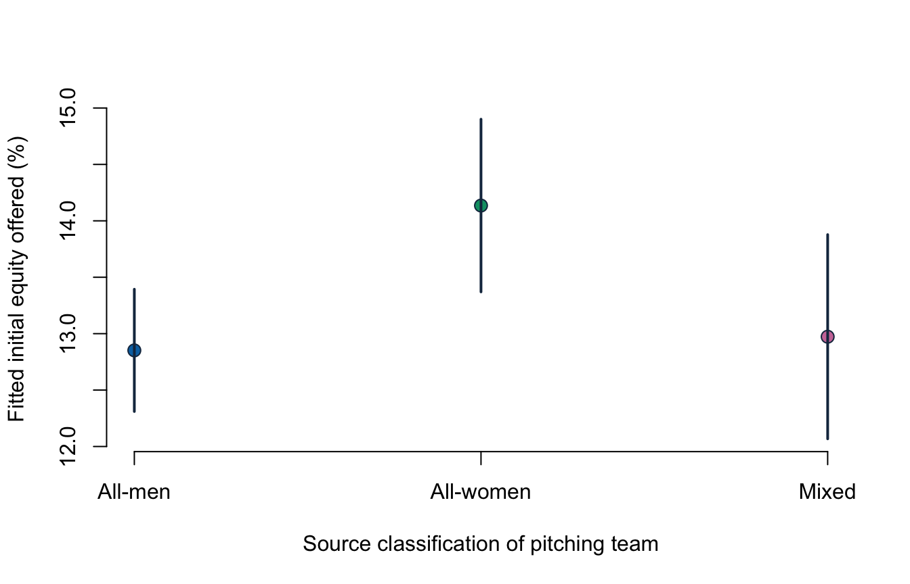

# Lecture 5: Dummy predictors and joint usefulness {#i05}


<div class="outcomes">
<span class="label">By the end of Lecture 5, you can</span>
<ul>
<li>encode a two-level or multi-level categorical predictor with dummy variables;</li>
<li>interpret dummy coefficients relative to a named reference group;</li>
<li>avoid the dummy-variable trap;</li>
<li>use an overall or partial F-test to assess joint usefulness;</li>
<li>separate adjusted associations from causal or essentialist claims.</li>
</ul>
</div>

::: {.course-phase .phase-before}

## Before class

<div class="video-prep">
<span class="label">Video preparation</span><br>
Watch Stanford Statistical Learning
<a href="https://www.youtube.com/watch?v=dEBQmiXv9fk&list=PLoROMvodv4rOzrYsAxzQyHb8n_RWNuS1e&index=13">3.5
Extensions of the Linear Model</a>. Focus on qualitative predictors and how a
reference category determines coefficient meaning.
</div>

Review [Mathematics Refresher: indicators and reference categories](#math-refresher)
if needed.

With three categories—`all_men`, `all_women`, and `mixed`—how many dummy
variables are needed in a model that includes an intercept?

<details>
<summary>Check your preparation</summary>

Two. One category is the reference group; the intercept represents it, and the
two dummy coefficients compare the remaining categories with it.

</details>

:::

::: {.course-phase .phase-in-class}

## In class

<p class="concept-video"><strong>Stanford explanation (review):</strong>
<a href="https://www.youtube.com/watch?v=dEBQmiXv9fk">3.5 Extensions of the Linear Model</a>.</p>

### A two-level indicator

For a binary predictor \(D_i\in\{0,1\}\),

\[
E[Y_i\mid D_i]=\beta_0+\beta_1D_i.
\]

Then

\[
E[Y_i\mid D_i=0]=\beta_0,
\qquad
E[Y_i\mid D_i=1]=\beta_0+\beta_1.
\]

Thus \(\beta_1\) is the expected difference between the 1 group and the 0
reference group.

### More than two categories

With \(G\) categories and an intercept, use \(G-1\) dummies. Including all
\(G\) dummies plus an intercept creates exact linear dependence because the
dummies sum to 1. This is the **dummy-variable trap**.

R creates the dummies automatically when a predictor is a factor. Set the
reference category deliberately and verify it.


``` r
levels(known_gender$gender)
```

```
## [1] "all_men"   "all_women" "mixed"
```

``` r
contrasts(known_gender$gender)
```

```
##           all_women mixed
## all_men           0     0
## all_women         1     0
## mixed             0     1
```

The source categories describe the presenting team as all men, all women, or
mixed. They do not measure the share of women, gender identity beyond the
source categories, or the composition of the full venture.

### Fit an adjusted category comparison


``` r
gender_model <- lm(
  equity_offered_pct ~ season + ask_100k + gender,
  data = known_gender
)
summary(gender_model)
```

```
## 
## Call:
## lm(formula = equity_offered_pct ~ season + ask_100k + gender, 
##     data = known_gender)
## 
## Residuals:
##     Min      1Q  Median      3Q     Max 
## -16.118  -4.778  -1.100   3.220  82.590 
## 
## Coefficients:
##                 Estimate Std. Error t value Pr(>|t|)    
## (Intercept)     20.83883    0.50649  41.143  < 2e-16 ***
## season          -0.82389    0.04780 -17.238  < 2e-16 ***
## ask_100k        -0.26613    0.05822  -4.571 5.28e-06 ***
## genderall_women  1.28352    0.48102   2.668  0.00771 ** 
## gendermixed      0.12093    0.54115   0.223  0.82320    
## ---
## Signif. codes:  0 '***' 0.001 '**' 0.01 '*' 0.05 '.' 0.1 ' ' 1
## 
## Residual standard error: 7.612 on 1429 degrees of freedom
## Multiple R-squared:  0.1913,	Adjusted R-squared:  0.189 
## F-statistic: 84.49 on 4 and 1429 DF,  p-value: < 2.2e-16
```

Holding season and requested amount fixed:

- all-women teams are fitted to offer about 1.28 percentage points more equity
  initially than all-men teams;
- mixed teams are fitted to differ from all-men teams by about 0.12 percentage
  points.

The all-women coefficient has a classical p-value of about 0.008; the mixed
coefficient has a p-value of about 0.823. These are two reference-group
comparisons, not a claim that gender causes the offers.

A complete dummy-coefficient interpretation must name both categories, give
the outcome unit, state the predictors held fixed, and preserve the sample and
measurement boundary. For example: “Among pitches with a recorded source
classification, all-women presenting teams are fitted to offer 1.28 equity
percentage points more than all-men presenting teams at the same season and
requested amount.”

Changing the reference group changes coefficient labels, not fitted values or
overall model fit.


``` r
known_gender$gender_women_ref <- relevel(known_gender$gender,
                                         ref = "all_women")
coef(lm(equity_offered_pct ~ season + ask_100k + gender_women_ref,
        data = known_gender))
```

```
##             (Intercept)                  season                ask_100k 
##              22.1223564              -0.8238940              -0.2661283 
## gender_women_refall_men   gender_women_refmixed 
##              -1.2835231              -1.1625889
```

### The overall F-test

For \(k\) slopes, the overall test is

\[
H_0:\beta_1=\cdots=\beta_k=0
\]

against at least one non-zero slope. In R, it appears in `summary(model)`.
For `gender_model`, the very small overall p-value says the full set of season,
request, and category predictors is jointly useful relative to an
intercept-only model.

### A partial F-test for a group of terms

An individual t-test asks whether one coefficient is zero. A partial F-test
asks whether several coefficients are jointly zero after retaining other
predictors.

To test whether the two gender dummies add information beyond season and
request:

\[
H_0:\beta_{all\_women}=\beta_{mixed}=0.
\]


``` r
anova(reduced_gender, gender_model)
```

```
## Analysis of Variance Table
## 
## Model 1: equity_offered_pct ~ season + ask_100k
## Model 2: equity_offered_pct ~ season + ask_100k + gender
##   Res.Df   RSS Df Sum of Sq      F Pr(>F)  
## 1   1431 83228                             
## 2   1429 82792  2    436.25 3.7649 0.0234 *
## ---
## Signif. codes:  0 '***' 0.001 '**' 0.01 '*' 0.05 '.' 0.1 ' ' 1
```

The partial F-test has p-value about 0.023. At 5%, the two source-category
terms are jointly useful in this specification. This statement is not
equivalent to saying every dummy coefficient is individually significant.

The reduced model must be **nested** inside the complete model: it is obtained
by setting the tested coefficients to zero while keeping the same analysis
rows.

### Visualise adjusted comparisons



The points compare fitted means at the same average season and request. The
intervals express model-based uncertainty, not causal effects or uncertainty
about how the categories were recorded.

:::

::: {.course-phase .phase-after}

## After class

### Retrieval

1. Why are only \(G-1\) dummies used with an intercept?
2. What does a dummy coefficient compare?
3. What changes when the reference group changes?
4. What does a partial F-test evaluate?
5. Why can a joint F-test reject when one individual t-test does not?

<details>
<summary>Check your answers</summary>

1. All \(G\) dummies sum to the intercept, creating exact collinearity.
2. A category with the named reference category, holding other included
   predictors fixed.
3. Coefficient representation changes; fitted values and overall fit do not.
4. Whether a specified group of coefficients is jointly zero in nested models.
5. The F-test evaluates the terms together; individual tests ask narrower
   questions and may have larger separate uncertainty.

</details>

### Practice

1. Relevel `gender` so `mixed` is the reference group and interpret both dummy
   coefficients. Save the relevelled model as `relevelled_model`.
2. Verify that fitted values are unchanged after releveling by comparing it
   with `gender_model`.
3. State the hypotheses for the partial F-test of both gender dummies.
4. Explain why the seven `unknown` records were excluded rather than treated
   as evidence of a substantive fourth group.
5. Write a 120-word interpretation of the full model that includes the source
   measurement boundary and causal limit.
6. Explain why “the all-women coefficient is 1.28%” is ambiguous, then rewrite
   it precisely.

<details>
<summary>Check your answers</summary>

1. Use:

   ```r
   mixed_reference <- relevel(known_gender$gender, ref = "mixed")
   relevelled_model <- lm(
     equity_offered_pct ~ season + ask_100k + mixed_reference,
     data = known_gender
   )
   coef(relevelled_model)
   ```

   At fixed season and request, the all-men coefficient is about \(-0.121\)
   percentage points and the all-women coefficient about \(1.163\) percentage
   points, each relative to mixed teams.
2. `all.equal(fitted(gender_model), fitted(relevelled_model))` returns `TRUE` up
   to numerical tolerance.
3. \(H_0:\beta_{all\_women}=\beta_{mixed}=0\) against at least one non-zero
   coefficient, with all-men as the current reference.
4. `unknown` records lack a known classification; absence of recorded
   information is not a meaningful team-composition category.
5. A complete answer reports estimates and units, reference group, held-fixed
   variables, uncertainty, selected sample, broad source coding, and the
   associational—not causal—scope.
6. It confuses percent with percentage points and omits the comparison and
   conditioning. A precise version is: “At the same season and requested
   amount, all-women presenting teams are fitted to offer 1.28 equity
   percentage points more initially than all-men presenting teams.”

</details>

Continue to [Lecture 6: Interactions and polynomial terms](#i06).

For a more formal treatment, see James et al., *An Introduction to Statistical
Learning*, 2nd ed., Sections 3.2.2 and 3.3.1.

:::
