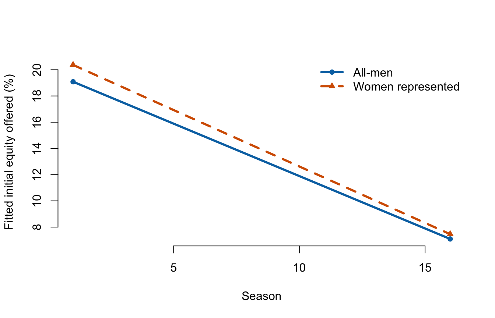
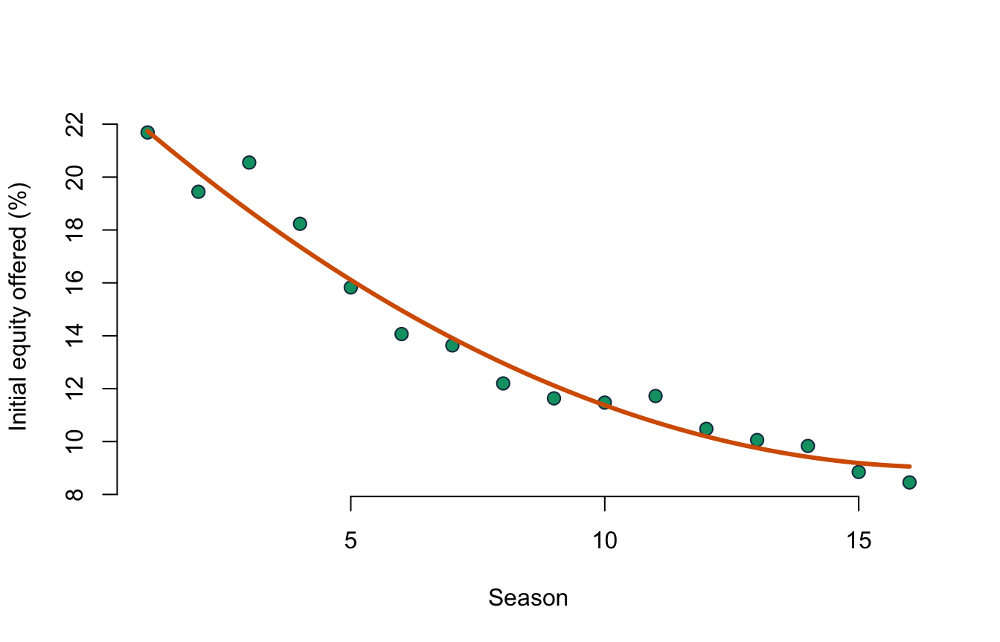

# Lecture 6: Interactions and polynomial terms {#i06}


<div class="outcomes">
<span class="label">By the end of Lecture 6, you can</span>
<ul>
<li>explain an interaction as a slope that depends on another variable;</li>
<li>interpret main effects in a model containing an interaction;</li>
<li>use centering to make lower-order terms more meaningful;</li>
<li>fit and interpret a quadratic term without reading its coefficients separately;</li>
<li>apply the hierarchy principle and communicate conditional predictions graphically.</li>
</ul>
</div>

::: {.course-phase .phase-before}

## Before class

<div class="video-prep">
<span class="label">Video preparation</span><br>
Watch Stanford Statistical Learning
<a href="https://www.youtube.com/watch?v=dEBQmiXv9fk&list=PLoROMvodv4rOzrYsAxzQyHb8n_RWNuS1e&index=13">3.5
Extensions of the Linear Model</a> and
<a href="https://www.youtube.com/watch?v=F-D3lZzYn50&list=PLoROMvodv4rOzrYsAxzQyHb8n_RWNuS1e&index=48">7.1
Polynomials and Step Functions</a>. Focus on why an interaction changes a
slope and why a polynomial remains a linear regression model in its
coefficients.
</div>

Review [Mathematics Refresher: products, powers, and centering](#math-refresher)
if needed.

In the model \(Y=\beta_0+\beta_1X+\beta_2D+\beta_3XD+\varepsilon\), write the
line for \(D=0\) and for \(D=1\).

<details>
<summary>Check your preparation</summary>

For \(D=0\), \(E[Y\mid X,D=0]=\beta_0+\beta_1X\). For \(D=1\),
\(E[Y\mid X,D=1]=(\beta_0+\beta_2)+(\beta_1+\beta_3)X\).

</details>

:::

::: {.course-phase .phase-in-class}

## In class

<p class="concept-video"><strong>Stanford explanations (review):</strong>
<a href="https://www.youtube.com/watch?v=dEBQmiXv9fk">3.5 Extensions of the Linear Model</a> and
<a href="https://www.youtube.com/watch?v=F-D3lZzYn50">7.1 Polynomials and Step Functions</a>.</p>

### Interaction means “it depends”

An additive model assumes the slope of \(X\) is the same at every value of
\(Z\):

\[
E[Y\mid X,Z]=\beta_0+\beta_1X+\beta_2Z.
\]

Adding a product allows that slope to vary:

\[
E[Y\mid X,Z]
=\beta_0+\beta_1X+\beta_2Z+\beta_3XZ.
\]

The change in the conditional mean for a one-unit increase in \(X\) is

\[
\beta_1+\beta_3Z.
\]

Thus \(\beta_3\) is a **difference in slopes**, not a standalone effect.
Its units combine the variables. If \(X\) is measured in seasons and \(Z\) is
an indicator, \(\beta_3\) is the difference in outcome units per season
between the indicator groups.

### A binary interaction

For this example only, `women = 1` means the source classifies the presenting
team as all-women or mixed; `women = 0` means all-men. It does not measure a
share of women or the full venture team. Seven unknown records are excluded.

Centre season at its sample mean:

\[
season\_c=season-\overline{season}.
\]

Then the lower-order `women` coefficient compares groups at the average season
rather than at the unobserved Season 0.


``` r
summary(interaction_model)
```

```
## 
## Call:
## lm(formula = equity_offered_pct ~ season_c * women + ask_100k, 
##     data = known_gender)
## 
## Residuals:
##     Min      1Q  Median      3Q     Max 
## -15.871  -4.742  -1.290   3.412  82.689 
## 
## Coefficients:
##                Estimate Std. Error t value Pr(>|t|)    
## (Intercept)    13.62479    0.33545  40.616  < 2e-16 ***
## season_c       -0.79938    0.06632 -12.053  < 2e-16 ***
## women           0.80697    0.41171   1.960   0.0502 .  
## ask_100k       -0.26776    0.05834  -4.590 4.83e-06 ***
## season_c:women -0.06146    0.09557  -0.643   0.5203    
## ---
## Signif. codes:  0 '***' 0.001 '**' 0.01 '*' 0.05 '.' 0.1 ' ' 1
## 
## Residual standard error: 7.62 on 1429 degrees of freedom
## Multiple R-squared:  0.1894,	Adjusted R-squared:  0.1871 
## F-statistic: 83.47 on 4 and 1429 DF,  p-value: < 2.2e-16
```

For all-men teams (`women = 0`), the fitted season slope is about \(-0.799\)
percentage points per season. For teams with women represented, it is

\[
-0.799+(-0.061)=-0.861.
\]

The interaction estimate is \(-0.061\), with p-value about 0.520. This model
does not provide evidence that the season trend differs between these two
broad source-defined groups. It also does not prove the slopes are identical.



Graph the model because neither \(\beta_1\) nor \(\beta_2\) is an overall effect
when an interaction is present.

### The hierarchy principle

If a model contains \(XZ\), ordinarily retain both \(X\) and \(Z\), even when
one lower-order term is not individually significant. The lower-order terms
define the lines whose difference the interaction describes.

In R:


``` r
lm(y ~ x * z, data = df)  # expands to x + z + x:z
```

### Polynomial terms model curvature

A quadratic conditional mean is

\[
E[Y\mid X=x]=\beta_0+\beta_1x+\beta_2x^2.
\]

It remains a linear regression model because it is linear in the unknown
coefficients \(\beta_0,\beta_1,\beta_2\).

The slope is not constant. A one-unit change from \(x\) to \(x+1\) changes the
fitted mean by

\[
\beta_1+\beta_2(2x+1).
\]

Therefore do not interpret \(\beta_1\) as the overall slope while \(x^2\) is in
the model. Compare fitted values or graph the curve.


``` r
summary(poly_season)
```

```
## 
## Call:
## lm(formula = equity_offered_pct ~ season + I(season^2) + ask_100k, 
##     data = sharks)
## 
## Residuals:
##     Min      1Q  Median      3Q     Max 
## -16.154  -4.549  -1.011   3.390  82.000 
## 
## Coefficients:
##             Estimate Std. Error t value Pr(>|t|)    
## (Intercept) 24.17168    0.82057  29.457  < 2e-16 ***
## season      -1.71323    0.20567  -8.330  < 2e-16 ***
## I(season^2)  0.05103    0.01137   4.489 7.74e-06 ***
## ask_100k    -0.27108    0.05740  -4.723 2.56e-06 ***
## ---
## Signif. codes:  0 '***' 0.001 '**' 0.01 '*' 0.05 '.' 0.1 ' ' 1
## 
## Residual standard error: 7.57 on 1437 degrees of freedom
## Multiple R-squared:  0.1981,	Adjusted R-squared:  0.1965 
## F-statistic: 118.3 on 3 and 1437 DF,  p-value: < 2.2e-16
```

``` r
anova(linear_season, poly_season)
```

```
## Analysis of Variance Table
## 
## Model 1: equity_offered_pct ~ season + ask_100k
## Model 2: equity_offered_pct ~ season + I(season^2) + ask_100k
##   Res.Df   RSS Df Sum of Sq      F    Pr(>F)    
## 1   1438 83493                                  
## 2   1437 82338  1    1154.5 20.149 7.737e-06 ***
## ---
## Signif. codes:  0 '***' 0.001 '**' 0.01 '*' 0.05 '.' 0.1 ' ' 1
```

The partial F-test for adding `season^2` has p-value below 0.001 in the
classical model. The fitted curvature is statistically detectable, but the
gain in adjusted \(R^2\) and the substantive shape should also be assessed.



The points are raw season means; the curve holds requested amount at its sample
mean. Do not extrapolate the quadratic beyond Seasons 1--16: polynomials can
turn sharply outside the observed range.

### Extensions do not replace assumptions

Interactions and polynomials make the conditional mean more flexible. They do
not solve dependence, selection, measurement error, heteroskedasticity, or
unmeasured confounding. Choose terms from a substantive question, inspect the
implied predictions, and report the relevant combined effects.

:::

::: {.course-phase .phase-after}

## After class

### Retrieval

1. What does an interaction coefficient measure?
2. Why centre a predictor before interacting it?
3. State the hierarchy principle.
4. Why is a quadratic model still a linear regression model?
5. Why should a polynomial be graphed and not extrapolated casually?

<details>
<summary>Check your answers</summary>

1. How one predictor's slope changes with the other predictor.
2. To make lower-order terms refer to a meaningful reference value such as the
   sample mean.
3. Retain the component lower-order terms when including their interaction or
   higher-order term.
4. It is linear in the unknown coefficients, even though it is curved in \(x\).
5. Component coefficients do not equal one constant slope, and polynomial
   curves can behave unrealistically outside the data range.

</details>

### Practice

1. In \(Y=10+2X+3D-0.5XD\), write both group lines and interpret the
   interaction.
2. Fit `season * women` with and without centering season. Verify that fitted
   values and the interaction coefficient remain unchanged.
3. Fit the linear and quadratic season models and compare adjusted \(R^2\).
4. Calculate the fitted change from Season 5 to 6 in the quadratic model.
5. Explain why the non-significant interaction is not evidence that source
   gender composition never matters.
6. State the units of the interaction coefficient in this model and interpret
   its estimate without using causal language.

<details>
<summary>Check your answers</summary>

1. For \(D=0\), the line is \(10+2X\). For \(D=1\), it is \(13+1.5X\).
   The \(D=1\) slope is 0.5 units smaller.
2. For example:

   ```r
   uncentered <- lm(equity_offered_pct ~ season * women + ask_100k,
                    data = known_gender)
   centered <- lm(equity_offered_pct ~ season_c * women + ask_100k,
                  data = known_gender)
   all.equal(fitted(uncentered), fitted(centered))
   coef(uncentered)["season:women"]
   coef(centered)["season_c:women"]
   ```

   The fitted values agree and both interaction estimates are about
   \(-0.0615\). Centering changes the intercept and lower-order group
   coefficient, not fitted values, the interaction estimate, or model fit.
3. Extract with `summary(model)$adj.r.squared`; adjusted \(R^2\) is about
   0.186 for the linear model and 0.196 for the quadratic model.
4. With estimates \(\beta_1\approx-1.713\) and
   \(\beta_2\approx0.0510\), the change is
   \(\beta_1+\beta_2(2\cdot5+1)\approx-1.15\) percentage points.
5. The test concerns one operationalisation, sample, model, and interaction;
   limited precision or misspecification can remain, and the source category
   is broad.
6. The unit is equity percentage points per season as a difference between
   groups. Holding requested amount fixed, the fitted seasonal slope for teams
   with women represented is 0.0615 percentage points per season more negative
   than for all-men teams; the two-sided test does not distinguish this
   difference from zero at 5%.

</details>

Continue to [Tutorial 2: Multiple regression and extensions](#i-ep02).

For a more formal treatment, see James et al., *An Introduction to Statistical
Learning*, 2nd ed., Section 3.3.2 and Sections 3.6.4--3.6.6.

:::
